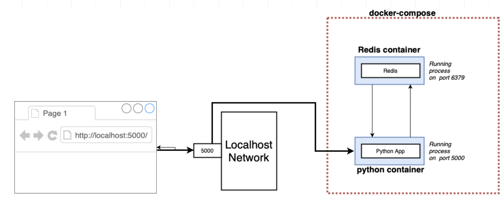

# Docker-compose

## What is Docker Compose and Why Use It?

Docker Compose is a tool that allows you to define and run multi-container Docker applications. It makes it easy to start and stop multiple containers with a single command, and provides a way to configure the containers and their relationships to each other.

<br />

Docker Compose is particularly useful for running complex applications that are made up of multiple services, each with its own requirements and dependencies. By using Docker Compose, you can define the configuration for all of these services in a single file, making it easier to manage and deploy your application.

### `YAML` syntax

YAML (short for "YAML Ain't Markup Language") is a human-readable data serialization language. **It is often used for configuration files and data exchange between different programming languages**. YAML is designed to be easily read by humans and can be used for complex or simple data structures.

<br />

**Docker Compose uses YAML syntax for its configuration files because it is easy to read and write**. Docker Compose configuration files define all the services that make up an application, as well as any associated networks, volumes, and environment variables. By using YAML syntax, it allows developers to easily define the relationships between the different parts of an application and deploy it consistently across different environments.

<br />

Few this to know about `yaml` syntax : 

- YAML files **use indentation to denote hierarchy**, instead of curly braces like JSON or XML.
- The syntax is strict about indentation, so it's important to use consistent spacing (usually 2 or 4 spaces) for each level of hierarchy.
- **Key-value pairs** are written as key: value, with the key and value separated by a colon and a space.
- **Lists are denoted by a dash (-) followed by a space**, and can contain any type of value.
- Comments can be added using the # symbol.

Here's an example YAML file that defines a simple docker-compose web service:

```yaml
version: '3'
services:
  web:
    image: nginx:latest
    ports:
      - "8080:80"
```

In this file:

- `version` specifies the Docker Compose file version.
- `services` is a list of Docker services to be created and run.
- `web` is the name of the first service.
- `image` specifies the Docker image to be used for the service.
- `ports` maps a port on the host machine to a port in the container.
- `"8080:80"` maps port 8080 on the host (your local machine or virtual machine in case you are in a VM) to port 80 in the container.

This is just a basic example, but hopefully it gives you an idea of how the YAML syntax works but it will be helpful for the next part.

## Docker Compose for a simple Python App and Redis database

Let's create a two containers application with a `docker-compose.yml` file with a python app and a redis database in order to count how many times the page is reload.

<br />



<br />

First thing first, write our `app.py` script :

```python
from flask import Flask
from redis import Redis

app = Flask(__name__)
redis = Redis(host='redis-container', port=6379)

@app.route('/')
def hello():
    redis.incr('hits')
    return ' - - - This basic web page has been viewed {} time(s) - - -'.format(redis.get('hits'))


if __name__ == "__main__":
    app.run(host="0.0.0.0", debug=True)
```

and the `requirements.txt` file : 

```
flask
redis
```
This is a simple Python Flask web application that increments a counter each time the / route is accessed and displays the number of times it has been accessed. The application uses Redis as a datastore to store the hit counter.

<br />

Here is how our `app.py` script works:

1. The Flask library is imported, which allows us to create a web application.
2. The Redis library is imported, which allows us to connect to a Redis instance and manipulate data.
3. The Flask application is created and the Redis client is initialized, connecting to the Redis container named "redis-container" at port 6379.
4. A route for the / endpoint is defined. When this route is accessed, the hit counter in Redis is incremented and the current count is displayed on the page.
5. Finally, the application is run, listening on all network interfaces (0.0.0.0) on port 5000 and with debugging enabled.

Then, we must write a `Dockerfile` : 

```dockerfile 
FROM python:3.6
WORKDIR /app
COPY . .
RUN pip install -r requirements.txt
CMD python app.py
```
Like before this is a simple `Dockerfile` for a python application. 

### Write the `docker-compose.yml` of our app

```yaml
version: '3'
services:
    web:
        build: ./app
        ports:
            - "5000:5000"
        volumes:
            - ./app:/app
        depends_on:
            - redis-container

    redis-container:
        image: redis
```
This script is a Docker Compose file that describes two services that will be run in Docker containers: a web service and a Redis service.

<br />

The `web` service is defined by the `web` service block. It specifies that the `web` service should be built from the Dockerfile in the `./app` directory, and should expose port 5000 on the host machine. The volumes directive maps the `./app` directory on the host to the `/app` directory in the container, allowing changes to the code to be immediately reflected in the container. The depends_on directive specifies that the `web` service should not start until the Redis service is running.

<br />

The Redis service is defined by the `redis-container` block. It specifies that the Redis image should be used to create the service.

<br />

This is the architeture of our project : 
```
.
|_docker-compose.yml
|_app
  |_Dockerfile
  |_requirements.txt
  |_app.py
```
Together, these services can be started with the `docker-compose up` command, which will build and start the web and Redis containers, and connect them together on a default Docker network.

<br />

<center>

</center>

<br />

You can also run your project in background with `-d` option then you should see your containers up and running with the command `docker ps`

## Docker Compose for a Python App and PostgreSQL 
Now that we understand how two containers works together let's code an application with a more efficient database : postgreSQL. 

### What is PostgreSQL

PostgreSQL, also known as Postgres, is a powerful and open-source relational database management system. It uses and extends the SQL language and provides many features such as support for JSON and other NoSQL features, scalability, and extensibility. It can run on various platforms such as Windows, macOS, Linux, and Unix.

<br />

Many organizations use Postgres for their data storage needs due to its reliability, robustness, and community support.

### Set up the project 

To create a Docker Compose file for your Python app, you'll need to define the services that make up your application. Each service is defined in the Docker Compose file as a separate block of configuration. In this example we will take the `nortwhind` database [here](https://github.com/pthom/northwind_psql) as base for our database service.

<br />

Download or `git clone` the `nortwhind` database [here](https://github.com/pthom/northwind_psql) and open the `docker-compose.yml` file bellow who define two services, one for a monitoring application `pgadmin` and one for a PostgreSQL database `db` :

```yaml
version: '3'

services:
  db:
    container_name: db
    image: postgres:latest
    environment:
      POSTGRES_DB: northwind
      POSTGRES_USER: postgres
      POSTGRES_PASSWORD: postgres
    volumes:
      - postgresql_bin:/usr/lib/postgresql
      - postgresql_data:/var/lib/postgresql/data
      - ./northwind.sql:/docker-entrypoint-initdb.d/northwind.sql
      - ./files:/files
    ports:
      - 55432:5432
    networks:
      - db

  pgadmin:
    container_name: pgadmin
    image: dpage/pgadmin4
    environment:
      PGADMIN_DEFAULT_EMAIL: pgadmin4@pgadmin.org
      PGADMIN_DEFAULT_PASSWORD: postgres
      PGADMIN_LISTEN_PORT: 5050
      PGADMIN_CONFIG_SERVER_MODE: 'False'
    volumes:
      - postgresql_bin:/usr/lib/postgresql
      - pgadmin_root_prefs:/root/.pgadmin
      - pgadmin_working_dir:/var/lib/pgadmin
      - ./files:/files
    ports:
      - 5050:5050
    networks:
      - db

networks:
  db:
    driver: bridge

volumes:
  pgadmin_root_prefs:
    driver: local
  pgadmin_working_dir:
    driver: local
  postgresql_data:
    driver: local
  postgresql_bin:
    driver: local
```


Let's break down this Docker Compose file:

- **version: '3'**: This specifies the version of the Docker Compose file format that we're using.
- **services**: This is where we define the services that make up our application.
    - `db`: The Postgres database service.
        - `container_name`: Sets the name of the container to db.
        - `image`: postgres:latest: Specifies the image to use for the container.
        - `environment`: Sets environment variables for the container.
            - `POSTGRES_DB`: northwind: Specifies the name of the database to create.
            - `POSTGRES_USER`: postgres: Specifies the username for the database.
            - `POSTGRES_PASSWORD`: postgres: Specifies the password for the database.
        - `volumes`: Mounts volumes for the container.
            - `postgresql_bin:/usr/lib/postgresql`: Mounts the PostgreSQL binaries.
            - `postgresql_data:/var/lib/postgresql/data`: Mounts the PostgreSQL data directory.
            - `./northwind.sql:/docker-entrypoint-initdb.d/northwind.sql`: Copies the northwind.sql script into the container for initializing the database.
            - `./files:/files`: Mounts the files directory into the container.
        - `ports`: Maps ports between the container and the host.
            - `55432:5432`: Maps port 5432 inside the container to port 55432 on the host.
    - `networks`: Specifies the networks to connect the container to.
        - `db`: Connects the container to the db network.
    - `pgadmin`: The pgAdmin web interface service in order to visualize our database 
        - `image : dpage/pgadmin4`: Specifies the image to use for the container.
        - `environment`: Sets environment variables for the container.
            - `PGADMIN_DEFAULT_EMAIL`: pgadmin4@pgadmin.org: Specifies the default email for pgAdmin.
            - `PGADMIN_DEFAULT_PASSWORD`: postgres: Specifies the default password for pgAdmin.
            - `PGADMIN_LISTEN_PORT: 5050`: Specifies the port for pgAdmin to listen on.
            - `PGADMIN_CONFIG_SERVER_MODE`: 'False': Disables server mode for pgAdmin.
        - `volumes`: Mounts volumes for the container.
        - `ports`: Maps ports between the container and the host.
            - `5050:5050`: Maps port 5050 inside the container to port 5050 on the host.
- **networks**: Specifies the networks to create.
    - `db`: Creates the db network.
    - `driver: bridge`: Specifies the driver to use for the network, this is the standard driver 🤓
- **volumes**: Specifies the volumes to create, see volume part in the table of content for more detailed 

Once you've defined your Docker Compose file, you can use the `docker-compose up` command to start and stop your application. Here are some of the most common commands:

- `docker-compose up`: This command starts your application and attaches your terminal to the logs of all running containers. You can use Ctrl+C to stop the containers and exit.
- `docker-compose up -d`: This command starts your application in detached mode, which means that it runs in the background. You can use docker-compose logs to view the logs of your containers.
- `docker-compose down`: This command stops and removes all containers, networks, and volumes that were created by docker-compose up.
- `docker-compose ps`: This command lists all running containers in your Docker Compose application.
- `docker-compose build`: This command builds the images for all of the services in your Docker Compose file.

By using Docker Compose, you can easily start and stop multiple containers with a single command, and manage the configuration of all of your services in a single file. This makes it easier to manage and deploy complex applications that are made up of multiple services.

### PgAdmin interface 

First let's confirm our containers are up and running by taping `docker ps` command. If you see the container running like :

```bash 
a76abdcbf8da   dpage/pgadmin4             "/entrypoint.sh"         About an hour ago   Up About an hour        80/tcp, 443/tcp, 0.0.0.0:5050->5050/tcp, :::5050->5050/tcp
```

To see our database go to : (localhost:5050)[http://localhost:5050] and write a random password (like root) then register our database by running the following command : 

1. Add a new server in PgAdmin 
2. In the general Tab, write the paramater `Name = db`
3. In the Connection Tab write the following parameters : 
```
Host name: db
Username: postgres
Password: postgres
```
4. Then, select database "northwind" and you can now see all the tables and metadata 🥳


### Add a Python app 

```python
from fastapi import FastAPI
from sqlalchemy import create_engine, text
from sqlalchemy.orm import sessionmaker

app = FastAPI()
engine = create_engine('postgresql://postgres:postgres@db/northwind')
Session = sessionmaker(bind=engine)

@app.get('/')
def read_root():

    session = Session()
    result = session.execute(text('SELECT customer_id, company_name, contact_name FROM customers LIMIT 10'))
    return {'Customers info': [dict(customerid=row[0], companyname=row[1], contactname=row[2]) for row in result]}
```

This application uses the FastAPI framework to define a simple endpoint that returns a JSON response with a greeting and a value from a PostgreSQL database.

<br />

To run this application using Docker Compose, you'll need to save this file as main.py in the same directory as your Dockerfile, and update your Docker Compose file to include the following environment variable for the app service and dependence :

```yaml
environment:
  DB_HOST: db
depends_on:
      - db
```
This environment variable tells the application where to find the PostgreSQL database and tell the application to wait for the lunch of the `db` service.

### Integrate our app to the `docker-compose.yml` file

```yaml
version: '3'

services:
  db:
    container_name: db
    image: postgres:latest
    environment:
      POSTGRES_DB: northwind
      POSTGRES_USER: postgres
      POSTGRES_PASSWORD: postgres
    volumes:
      - postgresql_bin:/usr/lib/postgresql
      - postgresql_data:/var/lib/postgresql/data
      - ./northwind.sql:/docker-entrypoint-initdb.d/northwind.sql
      - ./files:/files
    ports:
      - 55432:5432
    networks:
      - db

  pgadmin:
    container_name: pgadmin
    image: dpage/pgadmin4
    environment:
      PGADMIN_DEFAULT_EMAIL: pgadmin4@pgadmin.org
      PGADMIN_DEFAULT_PASSWORD: postgres
      PGADMIN_LISTEN_PORT: 5050
      PGADMIN_CONFIG_SERVER_MODE: 'False'
    volumes:
      - postgresql_bin:/usr/lib/postgresql
      - pgadmin_root_prefs:/root/.pgadmin
      - pgadmin_working_dir:/var/lib/pgadmin
      - ./files:/files
    ports:
      - 5050:5050
    networks:
      - db

  app:
    build:
      context: .
      dockerfile: Dockerfile
    environment:
      DB_HOST: db
    depends_on:
      - db
    ports:
      - "8000:8000"
    networks:
      - db

networks:
  db:
    driver: bridge

volumes:
  pgadmin_root_prefs:
    driver: local
  pgadmin_working_dir:
    driver: local
  postgresql_data:
    driver: local
  postgresql_bin:
    driver: local
```

The `app` service is a container that will host a Python application that uses the `northwind` database created by the `db` service. The app container will be built using the Dockerfile located in the same directory as the `docker-compose.yml` file. The `depends_on` property indicates that the app container must be started after the `db` container is running.

<br />

The environment property sets the `DB_HOST` environment variable, which is used in the application to connect to the `db` container. The ports property maps port `8000` of the `app` container to port `8000` of the host machine, allowing access to the FastAPI application from a web browser. The `networks` property specifies that the `app` container is connected to the `db` network, allowing communication between the application and the database.

<br />

Once you've made these changes, you can start your application using Docker Compose with the following command:

```
docker-compose up --build
```

This will start both the `db` and `app` services and rebuild it just in case, and you should be able to access the application by visiting http://localhost:8000 in your web browser.

## Stop docker-compose

Stop the server that was launched by docker compose up via `Ctrl-C` if you are in interactive mode, then remove the containers via:
```
docker-compose down
```
or just go to the root of your repository and run `docker-compose down`


