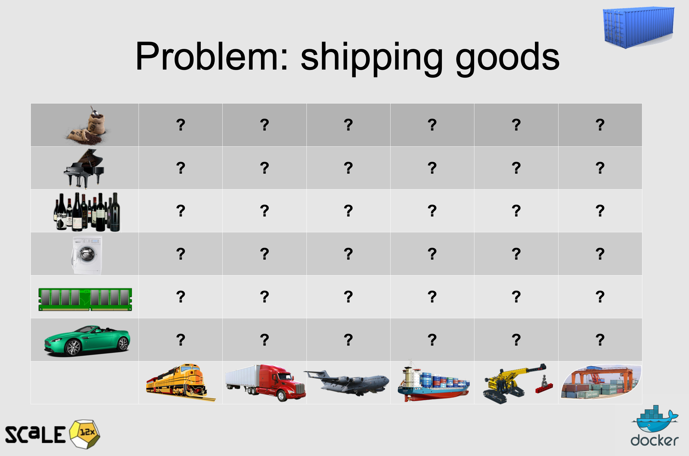
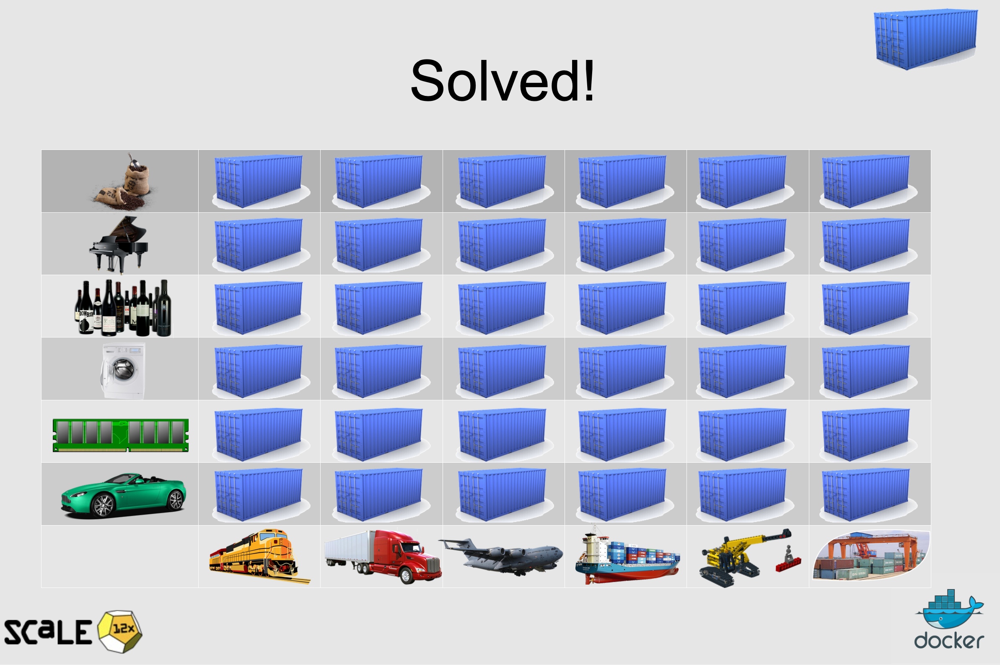
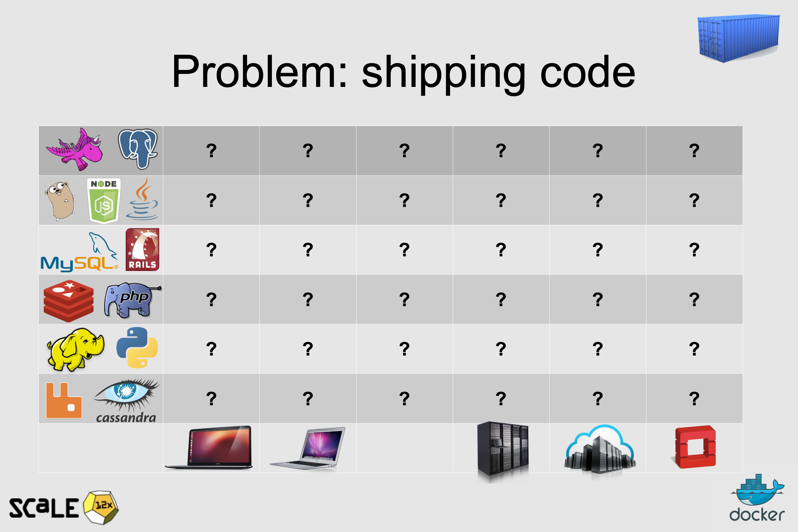
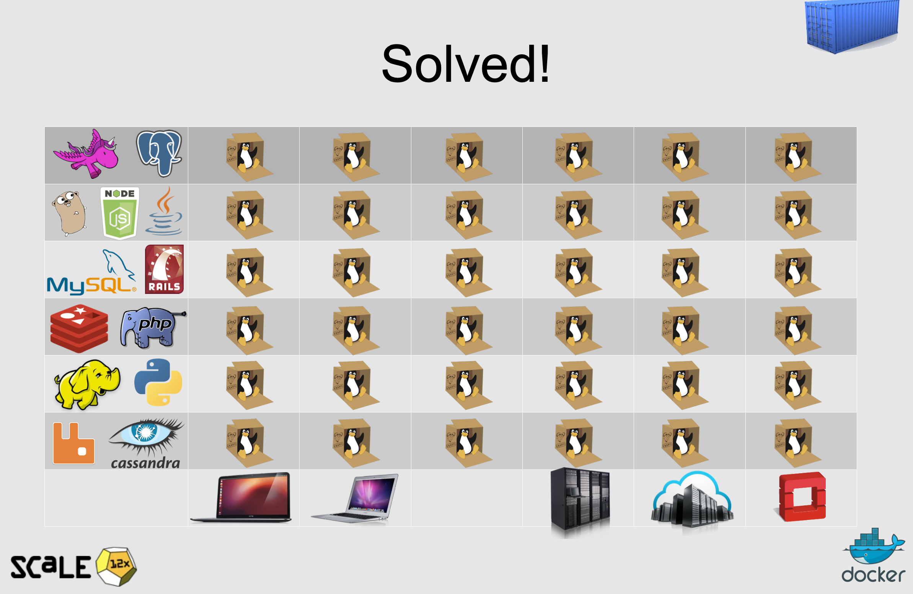

# Introduction to Docker

Docker is an open-source platform for building, shipping, and running applications as containers. **Docker solves the problem of "it works on my machine but not in production" by providing a consistent environment for running applications.** 

 

Traditionally, developers would build applications on their local machines, which could have different operating systems, libraries, and dependencies than the production environment. This could lead to compatibility issues and errors when the application was deployed to production.

 

 

With Docker, developers can package their applications and dependencies into a container, which provides a consistent environment for running the application. This means that the container can be run on any machine that has Docker installed, without worrying about differences in the underlying operating system or environment.

 

By using Docker, developers can ensure that their applications will work the same way in development, testing, and production environments. This can help to reduce the risk of compatibility issues and errors when deploying applications to production.

 

Docker also makes it easier to manage and scale applications. Containers can be quickly and easily deployed, scaled up or down, and updated, which helps to reduce the time and effort required to manage applications. This can help to improve the reliability and performance of applications, while also reducing costs and complexity.

 

In summary, Docker provides a consistent and reliable way to package, deploy, and manage applications, which helps to solve the problem of "it works on my machine but not in production". **By using Docker, developers can ensure that their applications will work the same way in all environments, which can help to improve the reliability and efficiency of application deployment.**

## What is Docker and Why Use It?

Docker provides a number of benefits over traditional methods of deploying applications:

- **Consistency** : Docker provides a consistent environment for running your application, regardless of where it is being run. This means that you can build your application once, and then run it in any environment that has Docker installed, without worrying about differences in operating systems, libraries, or dependencies.
- **Portability** : Docker containers are lightweight and portable, which means that you can easily move them between machines, or even between different cloud providers. This makes it easy to deploy your application to different environments, such as development, staging, and production.
- **Isolation** : Docker containers provide a high degree of isolation between different applications, which reduces the risk of conflicts between different components of your application stack. This means that you can run multiple applications on the same machine, without worrying about interference between them.
- **Resource Efficiency** : Docker containers are lightweight and use fewer resources than traditional virtual machines, which means that you can run more containers on the same machine. This can result in significant cost savings for cloud-based applications.

## Docker VS Virtual Machines

Let's talk about the difference between a traditional virtual machine (VM) architecture and a containerized architecture for that let's take a look at this figure : 

 

 

Starting with the VM architecture on the left, you can see that there is a physical server that hosts a hypervisor layer. The hypervisor layer creates multiple virtual machines, each of which has its own operating system (OS) and runs on top of the hypervisor layer. Each VM also has its own set of resources, such as CPU, memory, and storage, which are isolated from the other VMs.

 

In contrast, the containerized architecture on the right does not have a hypervisor layer. Instead, it has a host operating system that runs on top of the physical server. On top of the host operating system, there is a container runtime, which manages the creation and management of containers. Each container shares the host operating system with other containers, but each container has its own isolated file system, network, and process space.

 

Docker is a containerization technology that allows you to create, deploy, and manage containers. It provides a way to package and distribute software applications in a standardized and portable format, making it easy to move them from one environment to another. With Docker, you can create a Dockerfile that describes the dependencies and configuration of your application, and then use the Docker command-line interface to build, run, and manage containers based on that Dockerfile.

 

Overall, Docker provides a lightweight and flexible alternative to traditional VMs, making it easier to develop, deploy, and scale applications.

### What is a Containers 

Docker's use of the term "container" is inspired by the shipping industry. In the shipping industry, containers are standardized, self-contained units that can be easily transported between ships, trains, and trucks. These containers can hold a variety of goods and products, and they are designed to be easy to load and unload from transport vehicles. I love the slides of [@jpetazzo](https://github.com/jpetazzo/container.training) for illustrating this here : 

Similarly, in the context of software development, a container is a standardized, self-contained unit that can hold an application along with its dependencies and configurations. Like a shipping container, a software container can be easily transported between different environments, such as development, testing, and production.

By using the term "container", Docker is emphasizing the portability and standardization of its technology based on Linux system, which is similar to the shipping industry's use of containers to transport goods and products between different locations.

### Advantages of Containerization

Containerization provides several advantages over traditional deployment methods:

- **Portability** : Containers are self-contained units of software that can be easily moved between different environments.
- **Scalability** : Containers can be quickly and easily scaled up or down, depending on demand.
- **Consistency**: Containers provide a consistent environment for running applications, which makes it easier to manage and troubleshoot applications.
- **Resource Efficiency** : Containers use fewer resources than traditional virtual machines, which means that you can run more containers on the same hardware.
- **Security** : Containers provide a high degree of isolation between different applications, which helps to reduce the risk of security breaches.

In summary, Docker provides a flexible and efficient way to package and deploy applications as containers. By using Docker, you can create consistent, portable, and scalable environments for running your applications, which can help to reduce costs and improve reliability.

## 5 reasons why developers should consider using Docker 

- **Consistent Development Environments**: With Docker, developers can create a consistent environment for developing and testing applications. Docker allows developers to package an application along with all its dependencies, libraries, and configurations into a container. This ensures that the application will run the same way on any machine, regardless of the underlying operating system or environment.
- **Easy Collaboration**: Docker containers can be easily shared between developers, which makes it easier to collaborate on projects. Containers can be used to create a development environment that is identical across all team members, which helps to reduce the risk of compatibility issues and errors.
- **Faster Application Development and Deployment**: Docker makes it easier to develop and deploy applications by automating the process of packaging and deploying applications. Developers can quickly create and test new versions of an application in a container, and then deploy it to production with minimal effort.
- **Improved Testing**: Docker makes it easier to test applications by allowing developers to create multiple containers with different configurations and environments. This makes it easier to test applications in different scenarios, such as different operating systems, libraries, or dependencies.
- **Resource Efficiency**: Docker containers are lightweight and use fewer resources than traditional virtual machines, which means that developers can run more containers on the same machine. This can result in significant cost savings for cloud-based applications.

