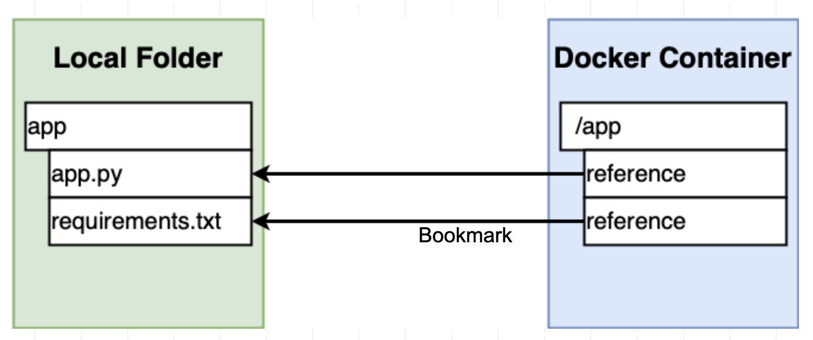

# Docker Volumes 

## What are Docker Volumes?

Docker volumes are a way to persist data outside of a container's file system. When you create a Docker volume, you create a new volume object that can be attached to one or more containers. Data can be written to or read from the volume, and the data will persist even if the container is removed or recreated.

## Using a Docker Volume for a Hello World FastAPI App

Let's say you have a simple Hello World FastAPI app that you want to run in a Docker container. Here's an example of what the Dockerfile might look like:

```dockerfile
FROM tiangolo/uvicorn-gunicorn-fastapi:python3.8

WORKDIR /app

COPY ./app /app

RUN pip install --no-cache-dir -r requirements.txt

CMD ["uvicorn", "app.main:app", "--host", "0.0.0.0", "--port", "80"]
```

This Dockerfile uses the `tiangolo/uvicorn-gunicorn-fastapi` base image and copies the app directory into the `/app` directory in the container.

<br />

Next, it runs the pip command to install the packages listed in the requirements.txt file. The `--no-cache-dir` flag is used to ensure that the packages are installed from scratch, rather than using any cached packages.

<br />

Finally, it sets the command to start the app using the Uvicorn server on port `80`.

<br />

Here's the code for the `app.py` file:

```python 
from fastapi import FastAPI

app = FastAPI()

@app.get("/")
def read_root():
    return {"Hello": "World"}
``` 
and the `requirements.txt` file : 
```
fastapi==0.68.1
uvicorn==0.15.0
```


### Why using volume

When you create a Docker volume and attach it to a container, it's like putting a bookmark from the container to a local folder on your host machine.

<br />



<br />

Just like a bookmark in a web browser, a volume allows you to quickly access a specific location in the container's file system, without having to navigate through all of the directories manually.

<br />

With a volume, you can also persist data outside of the container's file system. This can be useful if you need to share data between multiple containers, or if you need to keep data separate from the container image itself.

<br />

Overall, volumes are a powerful tool in Docker that allow you to manage and persist data in a flexible and efficient way.

### Add volume to `docker run`
With this Dockerfile, you can build and run the container using the following commands:

```bash
docker build -t myimage .

docker run -d --name mycontainer -p 8000:80 -v $(pwd):/app myimage
```

When you run this app in a Docker container, you can use a Docker volume to mount the `app.py` file into the container at runtime, rather than copying it into the container at build time. This has a few advantages:

- You can make changes to the app.py file without having to rebuild the entire Docker image.
- You can keep the app code and the container image separate, which can make it easier to manage and update the app over time.

