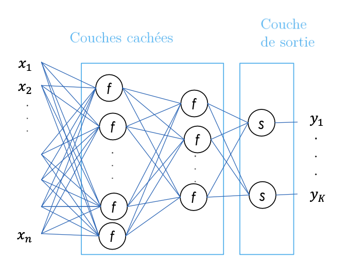
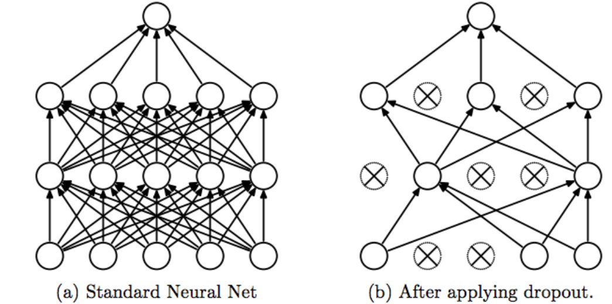

### What is Deep Learning

Deep Learning is a subfield of Machine Learning that uses deep neural networks to learn hierarchical representations of complex data. Unlike classical Machine Learning, which focuses on manually designing feature extraction from data, Deep Learning enables models to automatically learn from raw data without the need for feature engineering.

 

The advantages of Deep Learning include:

- **Improved performance** : Deep Learning models can learn from raw data and find important features for a given task, which can lead to improved performance on a wide variety of tasks, including computer vision, speech recognition, and natural language processing.

- **Scalability** : Deep neural networks can be designed to process massive amounts of data and can be used in distributed environments to further improve performance.

- **Adaptability** : Deep Learning models can be adapted to new datasets without major modifications to the model architecture, making them more flexible and adaptable than classical Machine Learning models.

However, Deep Learning also has some drawbacks, including:

- **Resource cost**: Training Deep Learning models can be very expensive in terms of time and computational resources, especially for massive datasets. Inference can also be costly, especially on mobile devices or embedded systems.

- **Lack of transparency** : Deep Learning models can be difficult to interpret, as they are often designed with hidden layers that make it difficult to understand how the model makes decisions. This can make debugging and troubleshooting more difficult.

- **Need for high-quality data** : Deep Learning models often require massive and high-quality datasets to achieve optimal performance. This can make training Deep Learning models difficult for domains where data is rare or expensive to collect.

### What is a Neuron

A neuron is the smallest processing unit in a neural network. It receives weighted inputs, sums them, and passes them through a nonlinear activation function to produce an output. The weights are parameters that are adjusted by the model during learning to minimize a cost function.

### What are Neural Network Layers

For a non-linear problem or task, multiple layers are used. A layer is a group of neurons that simultaneously process the inputs they receive. Neural network layers are usually organized in sequences, with each layer taking as input the outputs of the previous layer. Two types of layers can be distinguished:

- One or more hidden layers consisting of multiple neurons
- An output layer consisting of K neurons $y = [y_1, ...,y_k]$

- **In regression**: Continuous/single output neuron => last layer has a linear activation function

- **In classification**: The last layer has K neurons (K = number of classes) => The last layer has a softmax activation function that transforms the network's output into probabilities of belonging to the classes.

### What are Activation Functions

An activation function is a mathematical function used on a signal. It reproduces the activation potential found in the biology of the human brain. It allows information to pass or not depending on whether the stimulation threshold is reached. In practice, its role is to decide whether to activate a neuron's response or not. Here are the main activation functions that can be found in neural networks:

- **Linear**: Used in the output layer for regression. It can be characterized as null, since the output units will be identical to their input level. Output interval: (-∞;+∞).

- **Sigmoid (logistic)** : The most popular function for decades. But today, it becomes much less effective compared to others for use in hidden layers. Used in the output layer for binary classification. Output interval: {0,1}

- **TanH** : Used for continuous data in RNNs. Output range: (-1,1)

- **Softmax** : Used for multi-class classification in output layers. Output range: (-∞;+∞).

- **ReLU ( Rectified Linear Unit )** : These are the most popular activation functions nowadays. They allow for faster training compared to sigmoid and tanh functions, as they are lighter. Beware of the 'Dying ReLU' phenomenon, for which variations of ReLU are preferred. Very commonly used in CNNs, RBMs, and multi-layer perceptron networks. Output range: (0;+∞).

- **Leaky ReLU** : The Leaky ReLU adds a variant for negative numbers, so that neurons never die. They go into a long coma but always have the chance to wake up at some point. Output range: (-∞;+∞).

### What is backpropagation (How a neural network is trained)

Backpropagation is the optimization algorithm used to train neural networks. It is a gradient calculation method that allows for the calculation of the error gradients with respect to the weights of each neuron in the network, using the chain rule.

 

The backpropagation process begins with a forward pass step in which inputs are presented to the network, and predictions are calculated by passing successively through each layer of the network.

 

Next, the prediction error is calculated by comparing the network predictions to the actual output values. The goal of learning is to minimize this error.

 

From the prediction error, backpropagation calculates the error gradient with respect to each weight in the network, using the chain rule to calculate the gradients through the layers of the network from the last layer to the first.

 

Once the gradients have been calculated, they can be used to adjust the weights in the network using an optimization method such as stochastic gradient descent (SGD).

 

The entire backpropagation process is repeated many times, presenting different training data to the network at each iteration, until the network converges to a solution that minimizes the average prediction error over all training data.

 

**Terminology** : 

- Batch: subset of the training set
- Epoch: number of times all examples are seen during training
- Iteration: number of batches seen during training

### Understanding overfitting and underfitting

We want a network that can make predictions on new data. Depending on how the model is trained, we can encounter two problems:

- **Overfitting**: This represents a model that has memorized its training data, which works well on the training set but not on validation data. It then makes poor predictions on new data because they are not exactly the same as those in the training set. To remedy this, we need to improve the model's flexibility, for example, by using regularization concepts or early stopping.

- **Underfitting**: This represents a model that cannot deduce information from the data set. It does not learn enough and makes poor predictions on the training set. Therefore, the network needs to be more complex because it is not suitable for the types of input data. It is unable to capture the relationship between input data and their label.

In the case where the network's accuracy is not good on either the training set or the validation set, it means that the network has not had enough time to learn from the data. Therefore, we need to increase the number of iterations or increase the size of the data set.

### Network regularization with Dropout

Dropout is a regularization technique used to reduce overfitting in deep neural networks. The aim is to promote feature extraction independently to learn more general and diverse characteristics. This involves "turning off" or deactivating certain neurons of the model in a random manner in the same layer, which will not contribute to the feedforward phase or backpropagation phase. From the network's perspective, this amounts to instantiating the output value of an activation function to 0.

