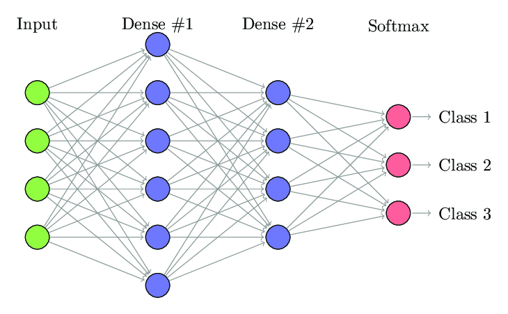

There are different types of neural networks, each with its own function and method of processing input data. Here's an overview of some common types of neural network layers:

### Fully Connected Layers (Dense Neural Networks)

A dense neural network, also known as a fully connected layer neural network, is a type of neural network where each neuron in a layer is connected to every neuron in the previous and next layer. This means that each neuron in the current layer takes into account all the activations from the previous layer and returns an activation that is propagated to all the neurons in the next layer.

  

  

The output of a dense layer is calculated as follows:

$$y_j = f\left(\sum_{i=1}^n w_{ji}x_i + b_j\right)$$

where:

- $y_j$ is the output of the $j$-th neuron in the dense layer.
- $x_i$ is the activation of the $i$-th neuron in the previous layer.
- $w_{ji}$ is the weight of the connection between the $i$-th neuron in the previous layer and the $j$-th neuron in the dense layer.
- $b_j$ is the bias (an additional parameter) of the $j$-th neuron in the dense layer.
- $f$ is the activation function applied to the weighted sum of the inputs.
- The activation function $f$ can be chosen based on the problem being solved.

### Convolutional Neural Networks (CNNs)

Convolutional Neural Networks (CNNs) are a type of neural network specifically designed for image processing. They were first introduced by Yann LeCun and his colleagues in 1998 for handwritten character recognition.

 
CNNs are based on convolution filters, which are weight matrices that are applied to regions of the image. Convolution filters extract visual features at different scales. For example, a convolution filter can be designed to detect edges in an image, while another filter can be designed to detect corners.

 
A convolutional neural network consists of several layers. The first layer is the input layer, which contains the raw image. The following layers are convolution layers, which apply convolution filters to the image. Each convolution filter produces a feature map, which is an image that highlights the specific features detected by the filter. The feature maps are then passed through an activation function, which introduces non-linearity into the model.

 
After the convolution layers, there are usually pooling layers, which reduce the dimensionality of the image by taking the maximum, average, or sum of small regions of the image. Pooling layers reduce computation time and make the model more robust to minor variations in the image.

 
After the pooling layers, there are usually fully connected layers, which are similar to the dense layers in traditional neural networks. Fully connected layers take the feature maps as input and transform them into an output representation that is used for classification or regression.

 
CNNs are trained using an optimization algorithm, such as Stochastic Gradient Descent, to minimize a loss function that measures the difference between the predicted output and the actual output. During training, the weights of the convolution filters and the fully connected layers are adjusted to minimize the loss function.

 

  

The equation for the output of a convolution layer is:

$$y(i,j,k) = \text{activation}\left(\sum_{l=1}^{p}\sum_{m=1}^{q}\sum_{n=1}^{r} w(m,n,l,k) x(i+m-1,j+n-1,l)\right)$$

where:

- $y(i,j,k)$ is the output of the $k$-th filter at position $(i,j)$ in the output feature map.
- $\text{activation}$ is the activation function applied element-wise to the sum of the weighted inputs.
- $w(m,n,l,k)$ is the weight of the $k$-th filter at position $(m,n)$ in the $l$-th input channel.
- $x(i+m-1,j+n-1,l)$ is the input activation at position $(i+m-1,j+n-1)$ in the $l$-th input channel.
- $p,q,r$ are the filter dimensions.

### Recurrent Neural Networks (RNNs)

A Recurrent Neural Network (RNN) is a type of neural network that is capable of processing sequences of data using feedback from previous outputs as input for future computations. Unlike traditional neural networks, RNNs have cyclic neuron connections, which allow them to store an internal memory of the information processed so far.

 
An RNN can be represented as a sequence of cells, where each cell is a copy of the same neural network. Each cell takes in the sequence data and the hidden state of the previous cell as input. The hidden state is a vector representation of the cell's internal memory, which is updated at each sequence step.

 
The output of each cell is fed back into the next cell and is also used for the final prediction. Therefore, the final prediction is based on the set of outputs from all cells in the sequence.

  

  

The output of an RNN cell is calculated as follows:

$$ h_t = f(W_{xh}x_t + W_{hh}h_{t-1} + b_h) $$

where:

- $h_t$ is the hidden state of the cell at time step $t$.
- $x_t$ is the input at time step $t$.
- $W_{xh}$ is the weight matrix for the connections between the inputs and the hidden state.
- $W_{hh}$ is the weight matrix for the connections between the previous hidden state and the current hidden state.
- $b_h$ is the bias added to the hidden state.
- $f$ is the activation function applied to the weighted input sum.

The cell output can also be used to predict the next value in the sequence:

$$ y_t = g(W_{hy}h_t + b_y) $$

where:

- $y_t$ is the prediction of the value in the sequence at time step $t$.
- $W_{hy}$ is the weight matrix for the connections between the hidden state and the prediction.
- $b_y$ is the bias added to the prediction.
- $g$ is the activation function applied to the weighted sum of inputs.

RNNs are widely used for sequence modeling, including speech recognition, machine translation, and text generation.

### Long Short-Term Memory Networks

These are enhanced recurrent neural networks that can handle longer sequences of data. Long Short-Term Memory networks use memory units that allow them to retain important information over a long period of time and are used for text generation, prediction of the next value in a time series, etc.

### Autoencoder Neural Networks

These are neural networks that learn to reconstruct an input from a latent representation by compressing the information into a hidden layer of neurons. Autoencoder neural networks are used for data compression, anomaly detection, etc.

### Generative Neural Networks

These are neural networks that learn to generate new data from a training set. Generative neural networks are used for text, image, and music generation, etc.