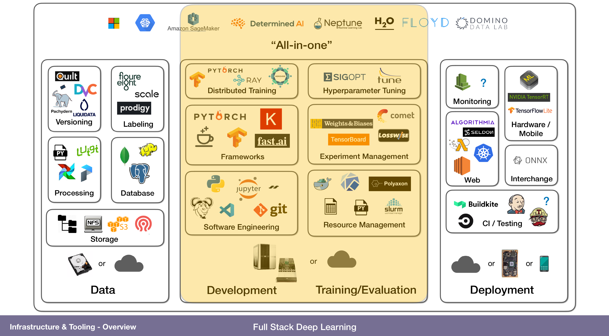

# MLOps Introduction 

MLOps, or Machine Learning Operations, is a set of practices, principles, and technologies designed to improve the efficiency and effectiveness of deploying, monitoring, and maintaining machine learning models in production environments. MLOps aims to bridge the gap between data science and operations teams, enabling seamless collaboration and smoother end-to-end machine learning workflows.

## The ML Technical Debt (why ML can be your biggest nightmare 😭)

**Your Biggest ML Nightmare**

*[At 3 am] Come quick! Our pricing is all screwed up! We are selling 13,000 USD cameras for 100 USD! ML Goes Wrong during Amazons Best Prime Day*

Imagine you are one of the Amazon ML Engineers, your team just released a new RNN Pricing Model to automate pricing setup based on purchase trends which you have painstakingly back-tested and tuned countless times. Your 2 years efforts finally built results and predicted to generate 1 M additional revenue per year.

You were so happy that you booked an expensive vacation to celebrate. You were on your way to the Bahamas until you received… Bad news.
Your ML model went rogue and mispriced all goods. You frantically opened your integration manager to roll back. But it was too late, the system already delivered the goods; you lost your company 3 M USD with your “cutting edge ML Model”.

The next day, you were determined to debug your model. You tested the model. It looked fine. Has the price distribution changed? Has the data preparation gone rogue? Or the quality data from the recent downstream changes? You racked your brain frantically but you were still clueless. So you decided to isolate each downstream data with virtual machines and different config files, rebuild the model from scratch, and test them one by one again. You lost track of each version update until it took a few sleepless nights to fix the issues.

*Your Cutting Edge ML Model Turns to your Biggest Nightmare During Data or Integration Changes*
[source](https://towardsdatascience.com/intro-to-mlops-ml-technical-debt-9d3d6107cd95)

### What is the "Technical debt"

Technical debt is the ongoing cost of expedient decisions made during code implementation. It is caused by shortcuts taken to give short-term benefit for earlier software releases and faster time-to-market. Technical debt tends to compound. Deferring the work to pay it off results in increasing costs, system brittleness, and reduced rates of innovation.

Similarly, in Artificial Intelligence and Machine Learning, we all tend to increase technical debts. We love to do “ninja fix”, taking shortcuts such as hard-code functionalities, smelly codes, and irresponsible copy-paste. These are perfectly fine and necessary if you are rushing for a deadline or deliver Proof of Concepts (POC). But it is extremely dangerous if unpaid.

<center>
<iframe src="https://giphy.com/embed/fCUCbWXe9JONVsJSUd" width="480" height="480" frameBorder="0" class="giphy-embed" allowFullScreen></iframe>
</center>

For more informations on this subject you can take a look at this incredible blog post from [Vincen Tatan](https://towardsdatascience.com/intro-to-mlops-ml-technical-debt-9d3d6107cd95)


## MLOps Principles 🎓

MLOps follows several key principles to ensure the successful deployment and management of machine learning models:

- **Version Control**: Track changes to code, data, and model artifacts to maintain a history of the development process with source and model registeries.
- **Reproducibility**: Ensure experiments and model training can be replicated consistently across different environments.
- **Automation**: Automate repetitive tasks, such as training, testing, and deploying models, to increase efficiency and minimize human error.
- **Continuous Integration and Deployment (CI/CD)**: Integrate and deploy changes to models and pipelines automatically, ensuring a consistent and up-to-date production environment.
- **Monitoring and Logging**: Monitor model performance, resource utilization, and system health, and maintain logs to facilitate debugging and traceability.
- **Collaboration**: Encourage collaboration between data scientists, ML engineers, and operations teams to streamline the development and deployment process.
- **Scalability**: Design models and infrastructure to handle increasing data volumes and computational needs.

I like this schema from [ml-ops.org](ml-ops.org) who shows the various phases of a typical MLOps workflow. 


## MLOps Tools and Technologies 🕹

There are numerous tools and technologies available for implementing MLOps. Some popular choices include:

- Version Control: Git, GitLab, GitHub, Bitbucket
- Experiment Tracking: MLflow, TensorBoard, Weights & Biases
- Pipeline Orchestration: Apache Airflow, Kubeflow, Prefect
- Model Serving: TensorFlow Serving, MLflow, TorchServe
- Containerization: Docker, Kubernetes, OpenShift
- CI/CD: Jenkins, GitLab CI/CD, GitHub Actions, CircleCI
- Monitoring and Logging: Grafana, Prometheus, ELK Stack (Elasticsearch, Logstash, Kibana)
- Cloud Providers: AWS, Google Cloud Platform, Microsoft Azure, IBM Cloud

I like this schema from [https://fall2019.fullstackdeeplearning.com/course-content/infrastructure-and-tooling](https://fall2019.fullstackdeeplearning.com/course-content/infrastructure-and-tooling) very good lecture for basic knowledge. 




## A word about Continuous Integration and Continuous Deployment (CI/CD) 🤓

CI/CD refers to the practices of automatically integrating code changes, testing them, and deploying them to production. In MLOps, CI/CD is essential for maintaining an up-to-date production environment with the latest models and configurations.

Overall, CI/CD can seem complicated at first, but with the right tools and processes in place, it can greatly simplify the development process and make it easier to deliver high-quality software quickly and efficiently. Basicly it means writing a lot of `yaml` files 😂

### Example: Using GitHub Actions for CI/CD

Let's take a look at GitHub Actions to automate the CI/CD process for a machine learning model. This type of files are located at : `.github/workflows/main.yml`

```yaml
name: ML Model CI/CD

on: [push]

jobs:
  build:
    runs-on: ubuntu-latest
    
    steps:
    - name: Check out repository
      uses: actions/checkout@v2
      
    - name: Set up Python environment
      uses: actions/setup-python@v2
      with:
        python-version: 3.8
        
    - name: Install dependencies
      run: |
        python -m pip install --upgrade pip
        pip install -r requirements.txt
        
    - name: Train model
      run: |
        python train.py
        
    - name: Test model
      run: |
        python test.py
        
    - name: Deploy model
      if: github.ref == 'refs/heads/main'
      run: |
        bash deploy.sh
```
Whenever some code is pushed to the repository containing this file, the workflow checks out the latest code, sets up a Python environment, installs dependencies, trains the model, tests it, and finally deploys it to production if the current branch is the `main` branch.

#### Sample deployement script 

The `deploy.sh` script, which is run in the last step of the workflow, could contain commands for deploying the trained model to a production environment, such as pushing the model to a model registry, updating a model serving API, or updating a Kubernetes deployment. Here's a simple example of what a `deploy.sh` script could look like when using MLflow for model registry and serving:

```bash
#!/bin/bash

# Set necessary environment variables (replace with your values)
export MLFLOW_TRACKING_URI=https://your.mlflow.server
export MLFLOW_S3_ENDPOINT_URL=https://your.s3.server
export AWS_ACCESS_KEY_ID=your_access_key
export AWS_SECRET_ACCESS_KEY=your_secret_key
export BUCKET_NAME=your_bucket_name
export MODEL_NAME=your_model_name
export MODEL_VERSION=your_model_version

# Log the trained model to MLflow
mlflow models build-register \
    --model-uri ./model \
    --name $MODEL_NAME \
    --version $MODEL_VERSION

# Deploy the registered model to MLflow Serving
mlflow models serve \
    --model-uri $MLFLOW_TRACKING_URI/registered-models/$MODEL_NAME/versions/$MODEL_VERSION \
    --host 0.0.0.0 \
    --port 8000 \
    --workers 4

```

In this example, the `deploy.sh` script logs the trained model to the MLflow model registry and then deploys it using MLflow Serving. The model is served at `0.0.0.0:8000` and can be accessed by any client that can reach that address.

## Model Monitoring and Logging 🎯

Monitoring model performance and logging system events are essential for maintaining the health and reliability of machine learning systems in production. By collecting and analyzing metrics and logs, you can detect issues early, optimize resource usage, and ensure that your models are performing as expected.

### Example: Setting up monitoring and logging using Prometheus and Grafana

Grafana is an open-source platform for data visualization and monitoring. It allows you to create interactive dashboards to visualize and analyze data from various sources. Grafana supports a wide range of data sources, including databases, messaging systems, and monitoring tools like Prometheus.

Prometheus, on the other hand, is an open-source monitoring system that collects metrics from different sources, such as services, applications, and operating systems. It stores the collected data in a time-series database and provides a query language to retrieve and analyze the data. Prometheus can also be integrated with Grafana to create interactive dashboards and alerting systems.

To monitor ML models with Grafana and Prometheus, you can **use Prometheus to collect metrics from your model's performance and store it in a time-series database. You can then use Grafana to create interactive dashboards to visualize and analyze the collected data**. 

For example, you can use Prometheus to collect metrics such as response time, request rate, and error rate from your model's API. You can then create a Grafana dashboard to visualize these metrics over time and identify trends and anomalies. You can also set up alerts in Prometheus to notify you when certain metrics exceed a predefined threshold.

Overall, using Grafana and Prometheus can help you monitor your models' performance and quickly identify and resolve issues, ensuring that your models are running smoothly and delivering accurate results. You can check the official documentations for more details : 

- Prometheus: https://prometheus.io/docs/prometheus/latest/
- Grafana: https://grafana.com/docs/grafana/latest/

My suggestion is to use docker for this Grafana and Prometheus stack, I find it much more simple and it's bind well with your production architecture (if you're using docker of course). 

A Prometheus template configuration file to collect metrics from your model serving API can look like this : 

```yaml
global:
  scrape_interval: 15s

scrape_configs:
  - job_name: 'model_serving'
    static_configs:
    - targets: ['<your_model_serving_api_host>:<port>']
```

It is very simple and straight forward, now you can connect Grafana to Prometheus as a data source with the Graphana GUI and create a dashboard in Grafana to visualize model performance and resource utilization metrics. 

By setting up Prometheus and Grafana, you can monitor and visualize key performance indicators for your machine learning models in production. These tools provide valuable insights into the health and performance of your models and enable you to take proactive action and business insights value. 

## Alerting and Incident Management 🚨

Alerting and incident management are essential components of MLOps that ensure your team can respond promptly to issues and maintain the stability and performance of your machine learning models in production. Popular tools for alerting and incident management include PagerDuty, Opsgenie, and VictorOps, among others.

### Example: Setting up alerting with Grafana and Slack

1. Set up a Slack workspace and create an incoming webhook for Grafana notifications:
    - Follow the instructions here: https://api.slack.com/messaging/webhooks
2. Configure Grafana to send notifications to Slack:
    - Open Grafana in your browser (usually at http://localhost:3000).
    - Log in with your credentials.
    - Go to Configuration > Alerting > Notification Channels > Add channel.
    - Enter a name for the channel, select "Slack" as the type, and fill in the webhook URL from step 1. You can also customize the message and include an image if desired.
    - Click "Test" to verify that the Slack integration works, then click "Save."
3. Create alert rules in Grafana to trigger notifications when specific conditions are met:
    - Go to the dashboard you created earlier.
    - Edit a panel to include an alert rule. For example, you might set an alert for when the error rate exceeds a certain threshold or when the latency is too high.
    - In the "Alert" tab, click "Create Alert," give it a name, and configure the conditions.
    - Under "Notifications," choose the Slack channel you created in step 2.
    - Save the panel and return to the dashboard.

Now, whenever an alert is triggered, a notification will be sent to your Slack workspace, allowing your team to quickly respond to issues and maintain the performance and stability of your machine learning models in production.

## Conclusion

In conclusion, MLOps is a crucial aspect of managing machine learning models in production environments. By implementing MLOps principles, using the right tools and technologies, and setting up monitoring, logging, and alerting systems, you can ensure the reliability and performance of your models and enhance collaboration between data scientists, ML engineers, and operations teams.