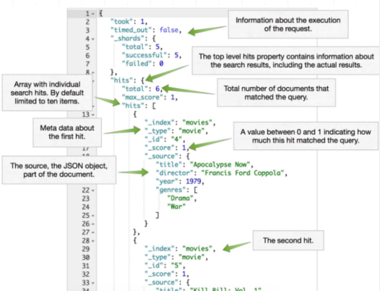

# Introduction to Elasticsearch

Elasticsearch is an open-source, document-based NoSQL database that is designed for full-text search and analytics. Elasticsearch is built on top of the Lucene search engine and is **optimized for fast search and retrieval of unstructured data**.

## Elastic architecture introduction 

Elasticsearch is a distributed, document-oriented NoSQL database that is optimized for search and analytics. It is built on top of the Lucene search engine and is designed to scale horizontally across multiple nodes and clusters.

### Cluster, nodes and replicas 

Nodes are individual instances of Elasticsearch that are part of a cluster. Each node stores a subset of the data in the cluster and is responsible for processing search and indexing requests for that data. Nodes can be added or removed from a cluster dynamically, allowing for easy scalability and fault tolerance.

A cluster is a collection of nodes that work together to store and process data. Elasticsearch clusters are designed to be highly available and fault tolerant, with built-in features for data replication and failover. Clusters can scale horizontally by adding more nodes to the cluster, allowing for increased processing power and storage capacity.

Sharding is the process of partitioning data across multiple nodes in a cluster. When a document is indexed in Elasticsearch, it is assigned to a specific shard based on a hashing algorithm that takes into account the document's ID. By default, each index in Elasticsearch is divided into five primary shards, with each shard having one or more replicas. This allows Elasticsearch to distribute the workload across multiple nodes, improving search and indexing performance.

The number of shards and replicas can be configured for each index based on the size and search requirements of the data. For example, a large index with a high write throughput might require more primary shards to distribute the data more evenly across nodes, while a smaller index with a lower write throughput might require fewer primary shards to reduce the overhead of managing multiple shards.

<center>

</center>

### Index

An index is like a database in a traditional relational database system. It is a logical container for one or more documents that share a similar structure and are stored together.

When you create an index in Elasticsearch, you can specify the mapping for the fields that the documents in the index will contain. The mapping defines the data types and formats for the fields, which allows Elasticsearch to index and search the data more efficiently.

You can also configure the number of primary shards that the index should have, which determines how the data in the index is distributed across nodes in the Elasticsearch cluster. This allows Elasticsearch to scale horizontally as the size of the index grows.

In addition, you can configure the number of replica shards for the index, which provide redundancy and allow for failover in case a primary shard becomes unavailable.

<center>

</center>

Overall, an index in Elasticsearch is a distributed, document-oriented NoSQL database that uses nodes, clusters, and sharding to provide scalability, fault tolerance, high availability and provides a way to organize and search data efficiently.

### Overall architecture 

The diagram shows a simplified architecture for an Elasticsearch cluster with three nodes. Each node is represented by a rectangular box and is labeled with its unique node name, IP address, and port number.

<center>

</center>

The nodes are connected to each other through a network, represented by the gray lines connecting the boxes. This network allows the nodes to communicate with each other and share data.

The Elasticsearch cluster is managed by a master node, which is responsible for coordinating the cluster and maintaining its state. In the diagram, the master node is indicated by the green box labeled "Master-eligible node."

The other nodes in the cluster are known as data nodes, and they are responsible for storing and indexing the data. In the diagram, the data nodes are indicated by the yellow boxes labeled "Data node."

Each data node stores a subset of the data in the cluster, and the data is distributed across the nodes using a technique called sharding. Each shard represents a portion of the data and is stored on a separate data node.

The client nodes, represented by the blue boxes labeled "Client node," are used to interact with the cluster and submit search and indexing requests. Client nodes do not store any data themselves, but they communicate with the data nodes to retrieve and manipulate the data.

Finally, the external world is represented by the orange box labeled "External clients," which can be any application or user that needs to interact with the Elasticsearch cluster.

Overall, the architecture diagram shows how an Elasticsearch cluster is composed of multiple nodes working together to store, index, and search data efficiently.

____________________________________________________________________

## Installation with Docker

To install Elasticsearch, we can use Docker, a containerization platform that simplifies the process of installing and running software applications. Install Docker on your machine if you haven't already.

Open a command prompt and run the following command to download and run the Elasticsearch Docker image:
```bash
docker run -p 9200:9200 -p 9300:9300 -d -e "discovery.type=single-node" docker.elastic.co/elasticsearch/elasticsearch:7.14.0
```

- `docker run`: This command tells Docker to run a container from an image.
- `-p` 9200:9200: This option maps port 9200 in the container to port 9200 on the host machine, allowing us to access Elasticsearch on port - `9200` from outside the container.
- `-p` 9300:9300: This option maps port 9300 in the container to port 9300 on the host machine, allowing nodes in the Elasticsearch cluster to communicate with each other on port 9300.
- `-d`: This option runs the container in detached mode, which means it runs in the background and doesn't attach to the terminal. This allows us to continue using the terminal while the container is running.
- `-e` "discovery.type=single-node": This option sets an environment variable in the container called discovery.type to single-node. This tells Elasticsearch to start as a single-node cluster, which is useful for testing or development purposes.
- `docker.elastic.co/elasticsearch/elasticsearch:7.14.0`: This is the name and version of the Elasticsearch image we want to run.

When you run this command, Docker will download the Elasticsearch image from Docker Hub (unless it's already downloaded), create a container from the image, and start Elasticsearch running inside the container. The container will be accessible on port 9200 and 9300, and Elasticsearch will be running as a single-node cluster 🥳

For more information about docker installation you can check the official documention [here](https://www.elastic.co/guide/en/elasticsearch/reference/current/docker.html)


### Test your installation 

#### Cluster info 
You can test if the elasticsearch container is running by run this command into your terminal (the `jq` command is here for a better return format, if you don't have it insall it [here](https://stedolan.github.io/jq/download/)) : 
```bash 
curl 0.0.0.0:9200/_cluster/health | jq
```

You should see this : 
```bash
  % Total    % Received % Xferd  Average Speed   Time    Time     Time  Current
                                 Dload  Upload   Total   Spent    Left  Speed
100   390  100   390    0     0    308      0  0:00:01  0:00:01 --:--:--   308
{
  "cluster_name": "docker-cluster",
  "status": "green",
  "timed_out": false,
  "number_of_nodes": 1,
  "number_of_data_nodes": 1,
  "active_primary_shards": 1,
  "active_shards": 1,
  "relocating_shards": 0,
  "initializing_shards": 0,
  "unassigned_shards": 0,
  "delayed_unassigned_shards": 0,
  "number_of_pending_tasks": 0,
  "number_of_in_flight_fetch": 0,
  "task_max_waiting_in_queue_millis": 0,
  "active_shards_percent_as_number": 100
}
```

This command returns information about the overall health of the Elasticsearch cluster. It provides information about the number of nodes in the cluster, the status of each node, the number of shards and replicas, and the overall status of the cluster. The response includes a variety of metrics such as the number of unassigned shards, the number of active and inactive primary shards, and the status of the cluster's overall health.

#### Nodes info
```bash 
curl -X GET "http://0.0.0.0:9200/_cat/nodes?v"
```
This command returns information about the nodes in the Elasticsearch cluster. It provides a summary of each node, including its IP address, node ID, and whether it is currently active or not. The response also includes a variety of metrics such as the number of open file descriptors, the amount of disk space used, and the amount of heap memory used.


## Data Modeling in Elasticsearch

Elasticsearch stores data as JSON-like documents, which can be nested and hierarchical. The data model in Elasticsearch is flexible, allowing for easy changes to the schema. 

**Documents are the primary storage structure in Elasticsearch. Each document contains reserved fields (the document's metadata), such as**:

<center>

</center>


- `_index`: where the document resides
- `_type`: the type of document it represents (database)
- `_id`: a unique identifier for the document
- `_source`: the data in the form of a dictionary

### `json` format overview 

JSON (JavaScript Object Notation) is a lightweight data interchange format that is easy for humans to read and write and easy for machines to parse and generate. It consists of key-value pairs, with each pair separated by a comma and enclosed in curly braces. Here's an example of a simple JSON document:

```json
{
  "name": "John Smith",
  "age": 35,
  "city": "New York"
}
```
In Elasticsearch, JSON is used as the primary format for documents that are stored and indexed in the database. Each document is represented as a JSON object, with fields that describe the properties of the document.

### Create an index and insert data 

Remember, an index is like a database in a traditional relational database system. 

We can create a specific index, let's say `cities` and *give it a certain settings like 2 shards and 2 replicas per shards* with the following command : 

```bash
curl -XPUT 'http://localhost:9200/cities' -H 'Content-Type: application/json' -d '
{
  "settings": {
    "number_of_shards": 2,
    "number_of_replicas": 2
  }
}'
```
you should see this response : 
```
{"acknowledged":true,"shards_acknowledged":true,"index":"my_index"}
```
To retrieve the index and verify its settings:
```
curl -XGET 'http://localhost:9200/my_index/_settings' | jq
```
you should see this output : 
```bash 
{
  "cities": {
    "settings": {
      "index": {
        "routing": {
          "allocation": {
            "include": {
              "_tier_preference": "data_content"
            }
          }
        },
        "number_of_shards": "2",
        "provided_name": "cities",
        "creation_date": "1678636556321",
        "number_of_replicas": "2",
        "uuid": "vsqBEmHWSBaki2AL-oClsA",
        "version": {
          "created": "7110199"
        }
      }
    }
  }
}
```

Now let's populate this index by creating our first document by running into our terminal : 
```bash 
curl -XPOST 'http://localhost:9200/cities/_doc' -H 'Content-Type: application/json' -d '
{
  "city": "London",
  "country": "England"
}'
```
You should see the following response confirmation : 
```bash 
{
  "_index": "cities",
  "_type": "_doc",
  "_id": "pquR1oYBQIvdICuNRLuD",
  "_version": 1,
  "result": "created",
  "_shards": {
    "total": 3,
    "successful": 1,
    "failed": 0
  },
  "_seq_no": 1,
  "_primary_term": 1
}
```
That's indicate the document is been created and inserted into our index with an unique id `pquR1oYBQIvdICuNRLuD` 🤓 

You can verify this by running this command : 
```bash 
curl -XGET 'http://localhost:9200/cities/_doc/{document_id}' 
```
You should see : 
```bash 
{
  "_index" : "cities",
  "_type" : "_doc",
  "_id" : "pquR1oYBQIvdICuNRLuD",
  "_version":1,
  "_seq_no":1,
  "_primary_term":1,
  "found":true
  "_source" : {
    "city" : "London",
    "country" : "England"
  }
}
```
As you can see, our document content is in the `_source` field, we will explain more the particular return format of elasticsearch. 

____________________________________________________________________

## Indexing data in Elasticsearch

### Create index from `json` file 
Let's create a bash script in order to insert few indices from json files and play with them. First download the json files [here](https://gist.github.com/bdallard/16aa2af027696c4ee4d0bb0db017276a) and run the following bash script into your terminal : 

```bash title="insert_data.sh"
curl -s -H "Content-Type: application/x-ndjson" -XPOST localhost:9200/receipe/_bulk --data-binary "@receipe.json" &&\
printf "\n✅ Insertion receipe index to elastic node OK ✅ "

curl -s -H "Content-Type: application/x-ndjson" -XPOST localhost:9200/accounts/docs/_bulk --data-binary "@accounts.json"
printf "\n✅ Insertion accounts index to elastic node OK ✅ "

curl -s -H "Content-Type: application/x-ndjson" -XPOST localhost:9200/movies/_bulk --data-binary "@movies.json"
printf "\n✅ Insertion movies index to elastic node OK ✅ "

curl -s -H "Content-Type: application/x-ndjson" -XPOST localhost:9200/products/_bulk --data-binary "@products.json"
printf "\n✅ Insertion products index to elastic node OK ✅ "
```

- `curl`: a command-line tool for sending HTTP requests and receiving HTTP responses from a server.
- `-s`: a flag that tells curl to operate silently, i.e., not to show the progress meter or any error messages.
- `-H` "Content-Type: application/x-ndjson": a header that sets the content type of the request to application/x-ndjson. This tells - Elasticsearch that the data being sent in the request body is in NDJSON format.
- `-XPOST`: a flag that tells curl to send a POST request to the specified URL.
- `localhost:9200/receipe/_bulk`: the URL of the Elasticsearch endpoint to which the request is being sent. In this case, it's the _bulk API for the receipe index on the local Elasticsearch instance running on port 9200.
- `--data-binary "@receipe.json"`: the request body, which is specified as a binary data file (@ symbol followed by the filename in this case receipe) in NDJSON format. The --data-binary flag tells curl to send the data as is, without any special interpretation.

Overall, this command is sending a bulk request to Elasticsearch to index data contained in the receipe.json file into the receipe index. The data is in NDJSON format, which is a format that Elasticsearch can parse and process efficiently.

### Working with Kibana interface 

For the rest of this section we will be working with kibana dev tools graphic user interface (GUI). You can run an elastic single node cluster and kibana GUI with the following docker-compose file : 

```yaml title="docker-compose.yml"
version: '2.2'
services:
  elasticsearch:
    image: docker.elastic.co/elasticsearch/elasticsearch:7.11.1
    container_name: elasticsearch
    restart: always
    environment:
      - xpack.security.enabled=false
      - discovery.type=single-node
    ulimits:
      memlock:
        soft: -1
        hard: -1
      nofile:
        soft: 65536
        hard: 65536
    cap_add:
      - IPC_LOCK
    volumes:
      - ./elas1:/usr/share/elasticsearch/data
    ports:
      - 9200:9200
      - 9300:9300
    networks:
      - esnet

  kibana:
    container_name: kibana
    image: docker.elastic.co/kibana/kibana:7.11.1
    restart: always
    ports:
      - 5601:5601
    depends_on:
      - elasticsearch
    networks:
      - esnet

networks:
  esnet:
    driver: bridge
```
This is a Docker Compose file that defines two services: Elasticsearch and Kibana.

The `elasticsearch` service uses the official Elasticsearch Docker image version 7.11.1. It sets the container name to elasticsearch and ensures that the container is always restarted if it stops or crashes. It disables X-Pack security and configures Elasticsearch to run as a single-node cluster. It also sets ulimit and cap_add settings to ensure that Elasticsearch has sufficient resources. Finally, it maps the `./elas1` directory on the host to `/usr/share/elasticsearch/data` inside the container, and exposes ports `9200` and `9300` to allow external access to Elasticsearch.

The `kibana` service uses the official Kibana Docker image version 7.11.1. It sets the container name to kibana and ensures that the container is always restarted if it stops or crashes. It exposes port `5601` to allow external access to Kibana. It also depends on the Elasticsearch service, so it won't start until Elasticsearch is up and running.

Overall, Kibana is a web-based user interface for Elasticsearch that allows you to interact with Elasticsearch data, run queries, and visualize data in various ways. One of the main advantages of using Kibana is that it provides a user-friendly interface for Elasticsearch, making it easier to explore and analyze data without needing to write complex queries.

It should take a few seconds to launch the installation and then you can go to : [http://localhost:5601/app/dev_tools#/console](http://localhost:5601/app/dev_tools#/console) in your browser to see the dev tool console 🤓

You can know verify all our indicies by running the following command : 
```ruby 
GET /_cat/indices?v
``` 

### Mapping

An index mapping in Elasticsearch is a way to define the structure of the documents that will be stored in an index. It specifies the fields that will be part of each document, along with their data types, properties, and settings.

When you create an index in Elasticsearch, you can either provide an explicit mapping or let Elasticsearch infer the mapping automatically based on the first document that is indexed. However, it is generally recommended to define an explicit mapping to ensure that the index has a consistent structure and to avoid unexpected field types or mappings.

An index mapping consists of two main components: field mappings and index settings.

Field mappings define the fields that will be part of each document in the index, along with their data types and properties. For example, a field mapping can define a string field that will store text data, or a numeric field that will store integer or float values. Field mappings can also specify additional settings such as the analyzer to use for text fields, or the format to use for date fields.

Index settings define various aspects of the index, such as the number of shards and replicas, the analysis settings, and the index lifecycle policies. For example, you can specify the number of primary and replica shards that the index will use, or the analyzer to use for text fields in the index.

Overall, an index mapping is an essential component of an Elasticsearch index that allows you to define the structure of the documents that will be stored in the index, along with various settings and configurations that affect the index behavior.

#### Get index mapping 

Let's take a look of our `receipe` index by tapping this into our kibana dev tool console : 
```bash
GET /receipe/_mapping
```
You should see this output : 

```bash
{
  "receipe" : {
    "mappings" : {
      "properties" : {
        "created" : {
          "type" : "date",
          "format" : "yyyy/MM/dd HH:mm:ss||yyyy/MM/dd||epoch_millis"
        },
        "description" : {
          "type" : "text",
          "fields" : {
            "keyword" : {
              "type" : "keyword",
              "ignore_above" : 256
            }
          }
        },
        "ingredients" : {
          "properties" : {
            "name" : {
              "type" : "text",
              "fields" : {
                "keyword" : {
                  "type" : "keyword",
                  "ignore_above" : 256
                }
              }
            },
            "quantity" : {
              "type" : "text",
              "fields" : {
                "keyword" : {
                  "type" : "keyword",
                  "ignore_above" : 256
                }
              }
            }
          }
        },
        "preparation_time_minutes" : {
          "type" : "long"
        },
        "ratings" : {
          "type" : "float"
        },
        "servings" : {
          "properties" : {
            "max" : {
              "type" : "long"
            },
            "min" : {
              "type" : "long"
            }
          }
        },
        "steps" : {
          "type" : "text",
          "fields" : {
            "keyword" : {
              "type" : "keyword",
              "ignore_above" : 256
            }
          }
        },
        "title" : {
          "type" : "text",
          "fields" : {
            "keyword" : {
              "type" : "keyword",
              "ignore_above" : 256
            }
          }
        }
      }
    }
  }
}
```
I know it is long but it is very explicit, it shows the structure of the `receipe.json` document, which has been indexed in Elasticsearch. Here's a breakdown of what each section of the mapping represents:

- The mapping is defined for the receipe index, which contains a single document type.
- The properties section contains all the fields that are part of each document in the index. In this case, the receipe.json document has **7 fields: created, description, ingredients, preparation_time_minutes, ratings, servings, and steps.**
- Each field in the properties section has a specific data type and additional properties that define how the data is indexed and stored. Here are the properties for each field :

    - `created`: a date field that can be parsed in the formats "yyyy/MM/dd HH:mm:ss", "yyyy/MM/dd", or as epoch milliseconds.
    - `description`: a text field that allows full-text search and has an additional keyword sub-field that can be used for exact matching.
    - `ingredients`: an object field that contains two sub-fields: name and quantity. Both sub-fields are text fields with an additional keyword sub-field.
    - `preparation_time_minutes`: a long field that stores the preparation time for the recipe in minutes.
    - `ratings`: a float field that stores the average rating for the recipe.
    - `servings`: an object field that contains two sub-fields: min and max. Both sub-fields are long fields that represent the minimum and maximum servings for the recipe.
    - `steps`: a text field that allows full-text search and has an additional keyword sub-field that can be used for exact matching.

Overall, this mapping provides a detailed description of the structure of the receipe.json document, which allows Elasticsearch to index and search the data efficiently. It also provides additional settings and properties that can be used to customize the behavior of the index and optimize its performance.

You can try to print the mapping for the other json documents 🤓

### First query 

Let's do our first query on the `movies` index, go to the kibana dev tool interface and copy this query : 
```ruby
GET movies/_search
{
  "query": {
    "match_all": {}
  }
}
```
This query retrieves all documents from the `movies` index in Elasticsearch. It uses the `match_all` query to match all documents in the index, which is equivalent to a `SELECT *` statement in SQL.

1. `GET movies/_search` indicates that we want to execute a search request on the movies index. The `_search` endpoint is used to search for documents in Elasticsearch we will see this later.
2. `"query": { "match_all": {} }` is the query definition. In this case, we're using the `match_all` query, which matches all documents in the index. The empty object `{}` inside the `match_all` query means that we're not applying any filters or constraints to the search results.

As you can notice elatic has a strange return format. Let's take a look at this return : 
<center>

</center>
____________________________________________________________________

## CRUD Operations in Elasticsearch

Elasticsearch supports CRUD (Create, Read, Update, and Delete) operations for manipulating data. Here are some examples of how to perform CRUD operations in Elasticsearch with our json documents :

### Create documents 

To create a new document in a given index, let's say the `receipe` index for example, use the following query : 

```ruby
POST receipe/_doc
{
  "created": "2022/03/12 12:00:00",
  "title": "Chocolate Cake",
  "description": "A rich and decadent chocolate cake recipe",
  "preparation_time_minutes": 60,
  "servings": {
    "min": 8,
    "max": 10
  },
  "ingredients": [
    {
      "name": "flour",
      "quantity": "2 cups"
    },
    {
      "name": "sugar",
      "quantity": "2 cups"
    },
    {
      "name": "cocoa powder",
      "quantity": "3/4 cup"
    },
    {
      "name": "baking powder",
      "quantity": "2 teaspoons"
    },
    {
      "name": "baking soda",
      "quantity": "2 teaspoons"
    },
    {
      "name": "salt",
      "quantity": "1 teaspoon"
    },
    {
      "name": "buttermilk",
      "quantity": "1 cup"
    },
    {
      "name": "vegetable oil",
      "quantity": "1/2 cup"
    },
    {
      "name": "eggs",
      "quantity": "2"
    },
    {
      "name": "vanilla extract",
      "quantity": "2 teaspoons"
    },
    {
      "name": "boiling water",
      "quantity": "1 cup"
    }
  ],
  "steps": "1. Preheat oven to 350 degrees F (175 degrees C). Grease and flour two 9-inch round cake pans.\n2. In a large mixing bowl, combine the flour, sugar, cocoa powder, baking powder, baking soda, and salt. Mix well.\n3. Add the buttermilk, vegetable oil, eggs, and vanilla extract. Beat with an electric mixer on medium speed for 2 minutes.\n4. Stir in the boiling water (the batter will be thin). Pour the batter into the prepared pans.\n5. Bake for 30 to 35 minutes, or until a toothpick inserted into the center of the cakes comes out clean.\n6. Allow the cakes to cool in the pans for 10 minutes, then remove them from the pans and cool completely on wire racks.\n7. Frost and decorate the cakes as desired."
}
```

You should see this return : 
```bash 
{
  "_index" : "receipe",
  "_type" : "_doc",
  "_id" : "p6va1oYBQIvdICuNjLvj",
  "_version" : 1,
  "result" : "created",
  "_shards" : {
    "total" : 2,
    "successful" : 1,
    "failed" : 0
  },
  "_seq_no" : 42,
  "_primary_term" : 13
}
```
With details, it means : 

- `_index`: The name of the index where the document was created, which in this case is "receipe".
- `_type`: The document type, which is "_doc" by default in Elasticsearch 7.x and later.
- `_id`: The unique ID of the newly created document. Elasticsearch automatically generates an ID if you don't provide one explicitly for our case `"_id" : "p6va1oYBQIvdICuNjLvj"`
- `_version`: The version of the document after the create operation. The initial version is always 1.
result: The result of the create operation, which is "created" in this case. This indicates that a new document was created.
- `_shards`: The number of shards involved in the create operation and the number of successful and failed shards. In this case, the create operation involved two shards and was successful on one shard.
- `_seq_no` and `_primary_term`: These values are used internally by Elasticsearch to manage replication and consistency. They are not relevant for most users.

Overall, this response confirms that the document was created successfully in the "receipe" index with a unique ID, version 1, and one successful shard.

If we want to create a document with a particular ID just modify the first line of the request by : 

```ruby 
POST receipe/_doc/9999
```
It will create a "receipe" document with an ID of `9999`. 

### Read documents
Like we have seen before you can run : 
```ruby
GET index/_doc/{document_id}
```

### Update documents

To update a document in the index, use the following query: 
```ruby
POST receipe/_update/{document_id}
{
  "doc": {
    "description": "A rich and decadent chocolate cake recipe with layers of buttercream frosting"
  }
}
```
Replace `{document_id}` with the ID of the document you want to update. This query updates the `description` field. 

### Delete documents
To delete a document from the index, use the following query:

```ruby
DELETE receipe/_doc/{document_id}
```

Replace `{document_id}` with the ID of the document you want to delete. This query deletes the specified document from the index.


That's it for the CRUD operations! These are the basic operations you can perform on documents in Elasticsearch. There are many other advanced features and queries you can use to search, analyze, and visualize your data !

____________________________________________________________________

## Querying Elasticsearch data


Querying in Elasticsearch can seem more complex than a traditional approach like SQL because Elasticsearch is designed to handle unstructured and semi-structured data, whereas traditional databases like SQL are designed to handle structured data.

In Elasticsearch, documents are stored as JSON objects, and each document can have different fields with different data types. This means that searching for information in Elasticsearch requires a different approach than searching for information in a traditional relational database, where the schema is predefined and all data is structured in tables with rows and columns.

Elasticsearch provides a wide range of powerful query options that allow you to search for information in your data in ways that would be difficult or impossible with a traditional relational database. For example, you can use full-text search, fuzzy matching, phrase matching, and regular expressions to search for text data. You can use range queries and geo-queries to search for numerical and geographic data. You can use aggregations to perform statistical analysis on your data. And you can use highlighting and suggesters to provide more user-friendly search results.

In addition, Elasticsearch is designed to be highly scalable and performant, which makes it an excellent choice for applications that require fast and efficient searching of large volumes of data. Elasticsearch can handle massive amounts of data and can be distributed across multiple nodes for even greater scalability and resilience.

Overall, while querying in Elasticsearch may require a different approach than querying in a traditional relational database, the powerful query options and scalability that Elasticsearch provides make it a better choice for information searching and retrieval in many cases.

### `_search` endpoint 

The `_search` endpoint is Elasticsearch's primary endpoint for querying data. It allows you to search one or more indices and retrieve matching documents. The response includes a list of documents that match the query, along with metadata such as the relevance score and any aggregations that were requested.

The main query types available in Elasticsearch are:

#### Match query 
A match query retrieves documents that match a specific keyword or phrase. Here's an example:
```
GET receipe/_search
{
  "query": {
    "match": {
      "title": "chocolate cake"
    }
  }
}
```

#### Term query
A term query retrieves documents that contain an exact term or phrase. Here's an example:
```
GET receipe/_search
{
  "query": {
    "term": {
      "title.keyword": "Chocolate Cake"
    }
  }
}
```

#### Range query 
A range query retrieves documents that contain a value within a specific range. Here's an example:
```
GET receipe/_search
{
  "query": {
    "range": {
      "preparation_time_minutes": {
        "gte": 60,
        "lte": 120
      }
    }
  }
}
```

#### Boolean query 
A query that combines multiple sub-queries using Boolean operators such as AND, OR, and NOT.
```
GET receipe/_search
{
  "query": {
    "bool": {
      "must": [
        {
          "match": {
            "title": "chocolate cake"
          }
        },
        {
          "range": {
            "preparation_time_minutes": {
              "gte": 60,
              "lte": 120
            }
          }
        }
      ]
    }
  }
}
```

#### Exists query
An exists query retrieves documents that contain a specific field. Here's an example:
```
GET receipe/_search
{
  "query": {
    "exists": {
      "field": "servings"
    }
  }
}
```

#### Prefix query
A prefix query retrieves documents that contain a specific prefix in a field. Here's an example:
```
GET receipe/_search
{
  "query": {
    "prefix": {
      "title.keyword": "choc"
    }
  }
}
```

#### Wildcard query
A query that retrieves documents that match a specified wildcard pattern in a specified field.
```
GET receipe/_search
{
  "query": {
    "wildcard": {
      "title.keyword": "Choc*"
    }
  }
}
```

#### Regexp query: A query that retrieves documents that match a specified regular expression pattern in a specified field.

#### Fuzzy query
A query that retrieves documents that are similar to a specified search term, accounting for minor spelling errors and variations.
```
GET receipe/_search
{
  "query": {
    "fuzzy": {
      "title": {
        "value": "choclete",
        "fuzziness": 2
      }
    }
  }
}
```

#### Match Phrase Prefix query
A query that retrieves documents that contain a prefix of a specified phrase in a specified field
```
GET receipe/_search
{
  "query": {
    "match_phrase_prefix": {
      "title": "chocolate c"
    }
  }
}
```

#### Common Terms query 
A query that retrieves documents that contain common terms in a specified field, while filtering out terms that are too common.
```
GET receipe/_search
{
  "query": {
    "match_phrase_prefix": {
      "title": "chocolate c"
    }
  }
}
```

#### Query String query 
A query that allows you to use advanced search syntax to search for documents in one or more fields.
```
GET receipe/_search
{
  "query": {
    "query_string": {
      "default_field": "title",
      "query": "chocolate AND cake"
    }
  }
}
```

#### Match Phrase query 
A query that retrieves documents that contain a specific phrase in a specified field.
```
GET receipe/_search
{
  "query": {
    "match_phrase": {
      "title": "chocolate cake"
    }
  }
}
```

#### Match Boolean Prefix query
A query that retrieves documents that contain a prefix of a specific phrase, using boolean logic to filter out unwanted results.
```
GET receipe/_search
{
  "query": {
    "match_bool_prefix": {
      "description": "chocolate ca",
      "operator": "and"
    }
  }
}
```

#### Terms query 
A query that retrieves documents that contain any of a set of specified terms in a specified field.
```
GET receipe/_search
{
  "query": {
    "terms": {
      "ingredients.name.keyword": ["chocolate", "sugar"]
    }
  }
}
```

#### Nested query
A query that allows you to search within arrays of objects in a specific field.

```
GET receipe/_search
{
  "query": {
    "nested": {
      "path": "ingredients",
      "query": {
        "bool": {
          "must": [
            {
              "match": {
                "ingredients.name": "chocolate"
              }
            },
            {
              "match": {
                "ingredients.quantity": "1 cup"
              }
            }
          ]
        }
      }
    }
  }
}
```

#### Geo Distance query
A query that retrieves documents that fall within a specified distance of a geographic location.

```
GET some_geo_data_index/_search
{
  "query": {
    "bool": {
      "filter": {
        "geo_distance": {
          "distance": "50km",
          "location": {
            "lat": 40.715,
            "lon": -74.011
          }
        }
      }
    }
  }
}
```

#### More Like This query 
A query that retrieves documents that are similar to a specified document.
```
GET receipe/_search
{
  "query": {
    "more_like_this": {
      "fields": ["title", "description"],
      "like": [
        {
          "_index": "receipe",
          "_id": "9999"
        }
      ],
      "min_term_freq": 1,
      "min_doc_freq": 1
    }
  }
}
```

#### Script query
A query that allows you to write custom scripts to search for documents.
```
GET receipe/_search
{
  "query": {
    "script": {
      "script": {
        "source": "doc['preparation_time_minutes'].value > params.time",
        "params": {
          "time": 60
        }
      }
    }
  }
}
```

#### Highlighting
A feature that allows you to highlight matching terms in your search results.
```
GET receipe/_search
{
  "query": {
    "match": {
      "description": "chocolate"
    }
  },
  "highlight": {
    "fields": {
      "description": {}
    }
  }
}
```

#### Aggregations
A feature that allows you to perform statistical analysis and grouping of your data.
```
GET receipe/_search
{
  "aggs": {
    "group_by_ratings": {
      "terms": {
        "field": "ratings"
      }
    }
  }
}
```

#### Sorting
A feature that allows you to sort your search results by one or more fields.
```
GET receipe/_search
{
  "sort": [
    { "preparation_time_minutes": "asc" },
    { "ratings": "desc" }
  ],
  "query": {
    "match": {
      "title": "cake"
    }
  }
}
```

#### Relevance Score
A score that indicates how well a document matches a query.
```
GET receipe/_search
{
  "query": {
    "match": {
      "title": "chocolate cake"
    }
  },
  "explain": true
}
```

#### Suggesters 
A feature that allows you to provide suggestions for misspelled or incomplete search terms.
```
GET receipe/_search
{
  "suggest": {
    "title-suggestion": {
      "text": "choclate cake",
      "term": {
        "field": "title"
      }
    }
  }
}
```


#### Rescoring
A feature that allows you to re-rank your search results using a different algorithm or set of parameters.
```
GET receipe/_search
{
  "query": {
    "match": {
      "title": "chocolate cake"
    }
  },
  "rescore": {
    "window_size": 50,
    "query": {
      "rescore_query": {
        "match": {
          "description": "chocolate"
        }
      },
      "query_weight": 0.7,
      "rescore_query_weight": 1.2
    }
  }
}
```


These are the main query types available in Elasticsearch. It's important to consult the Elasticsearch documentation for more information and advanced query options.

____________________________________________________________________

## Aggregation in Elasticsearch
