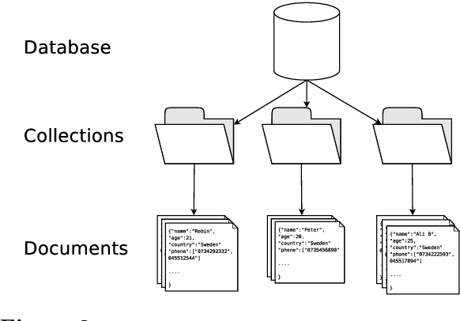
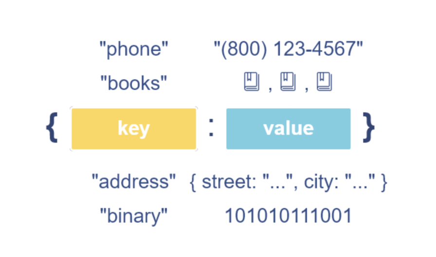

# What are NoSQL databases?

**NoSQL databases, also known as "non-relational" databases, are a class of databases that don't use the traditional relational data model**. Instead, they use various data models such as document-based, key-value, column-family, or graph-based to store and manage data.

The term NoSQL was coined **in the late 2000s to refer to databases that were not based on SQL**, the traditional relational database query language. NoSQL databases are designed to handle large volumes of unstructured or semi-structured data that cannot be easily organized into tables with predefined columns and relationships.

## Key characteristics of NoSQL databases 

NoSQL databases are important in modern data-driven applications because they offer several advantages over traditional relational databases. For example:

- **Schema flexibility**: Unlike traditional relational databases, NoSQL databases offer schema flexibility, which means that they don't enforce a predefined schema for data storage. This allows for greater flexibility in data modeling and can simplify development processes, as it eliminates the need to define and maintain rigid schemas.
- **Scalability**: NoSQL databases are designed to scale horizontally, which means that they can handle large volumes of data by adding more servers to the cluster. This allows for better performance and can reduce infrastructure costs over time.
**High availability**: NoSQL databases are designed to offer high availability, which means that they are able to maintain a high level of uptime even in the event of hardware failures or network outages. This is achieved through techniques such as replication and sharding.
**Data model diversity**: NoSQL databases offer a variety of data models, such as document-based, key-value, column-family, and graph-based, which can be used to store different types of data. This allows developers to choose the most appropriate data model for their application, rather than being limited to a single relational data model.
- **Performance**: NoSQL databases can offer better performance than traditional relational databases, particularly when dealing with large data sets. This is because NoSQL databases are designed to optimize read and write operations for large-scale data processing.

NoSQL databases have become increasingly popular in recent years, particularly in the context of big data and real-time data processing. They are used by a wide range of organizations, from startups to large enterprises, for applications such as e-commerce, social media, and mobile apps.

## Examples of NoSQL databases

There is a lot of  popular technologies of NoSQL databases such as : 

- **MongoDB**: MongoDB is a document-based NoSQL database that uses JSON-like documents to store data. It offers scalability, flexibility, and high availability, and is often used for applications that require real-time analytics, content management, and social media. MongoDB is also known for its support for complex queries, indexing, and sharding.
- **Elasticsearch**: Elasticsearch is a document-based NoSQL database that is designed for full-text search and analytics. It offers fast search and retrieval of unstructured data, and is often used for applications that require real-time search, logging, and data analysis. Elasticsearch is also known for its support for indexing, sharding, and clustering.
- **Redis**: Redis is a key-value NoSQL database that uses in-memory data structures to store data. It offers high performance and scalability, and is often used for applications that require real-time data processing, caching, and message brokering. Redis is also known for its support for data types such as strings, hashes, lists, and sets.
- **Neo4j**: Neo4j is a graph-based NoSQL database that uses nodes and edges to store data. It offers high scalability and performance, and is often used for applications that require complex data modeling, such as social networking, recommendation engines, and fraud detection.

Here's quick tips on how to choose between NoSQL databases technology based on the examples given:

- MongoDB: If you require a document-based data model and need to store JSON-like data, MongoDB may be a good fit. MongoDB is also a good choice for applications that require scalability, flexibility, and high availability, such as real-time analytics, content management, and social media.
- Redis: If you require fast data processing and caching, Redis may be a good fit. Redis is optimized for in-memory data storage and retrieval, and is often used for applications that require real-time data processing, message brokering, and caching.
- Neo4j: If you require complex data modeling and relationships, such as graph-based data, Neo4j may be a good fit. Neo4j is optimized for graph-based data storage and retrieval, and is often used for applications that require social networking, recommendation engines, and fraud detection.
- Elasticsearch: If you require fast search and retrieval of unstructured data, Elasticsearch may be a good fit. Elasticsearch is specifically designed for full-text search and analytics, and is often used for applications that require real-time search, logging, and data analysis.

When choosing a NoSQL database technology, it's important to consider factors such as data model, scalability, performance, data consistency, and ease of use. It's also important to consider the specific use case and requirements of the application to determine which NoSQL technology is the best fit.

## Types of NoSQL databases

NoSQL databases are a type of non-relational databases that are designed to handle large volumes of unstructured data. Unlike traditional relational databases, NoSQL databases do not rely on a fixed schema to store data, which makes them highly flexible and scalable.

There are several types of NoSQL databases, each with its own strengths and weaknesses. In this tutorial, we will provide an overview of the most common types of NoSQL databases, including document-based, key-value, column-family, and graph-based databases.

### Document-Based Databases

Document-based databases store data in a semi-structured format, such as JSON or XML. Each document in the database contains a set of key-value pairs that define its structure. Document-based databases are highly flexible and can easily accommodate changes to the data schema.

One of the most popular document-based databases is MongoDB. MongoDB is known for its scalability, flexibility, and high availability. It is often used for real-time analytics, content management, and social media.

### Key-Value Databases

Key-value databases store data as a collection of key-value pairs. Each key is unique and corresponds to a value, which can be a string, number, or more complex data structure. Key-value databases are highly efficient for read and write operations, making them ideal for applications that require high performance and scalability.

One of the most popular key-value databases is Redis. Redis is known for its fast in-memory data storage and retrieval, and is often used for real-time data processing, caching, and message brokering.

### Column-Family Databases

Column-family databases store data in column families, which are groups of related columns. Each column can contain multiple values, which are stored as a collection of key-value pairs. Column-family databases are highly scalable and can handle large volumes of data.

One of the most popular column-family databases is Apache Cassandra. Cassandra is known for its scalability and high availability, and is often used for online transaction processing, financial services, and e-commerce.

### Graph-Based Databases

Graph-based databases store data in nodes and edges, which represent entities and relationships between entities, respectively. Graph-based databases are highly flexible and can accommodate complex data models and relationships.

One of the most popular graph-based databases is Neo4j. Neo4j is known for its performance and scalability, and is often used for applications that require complex data modeling, such as social networking, recommendation engines, and fraud detection.

NoSQL databases offer several advantages over traditional relational databases, including flexibility, scalability, and performance. By understanding the different types of NoSQL databases, you can choose the one that best fits your application's requirements.

In summary, document-based databases are ideal for applications that require flexibility and real-time analytics, key-value databases are ideal for applications that require high performance and scalability, column-family databases are ideal for applications that require scalability and high availability, and graph-based databases are ideal for applications that require complex data modeling and relationships.

## Use cases for NoSQL databases

NoSQL databases are ideal for applications that require flexibility, scalability, and high performance. Some common use cases for NoSQL databases include:

- **Real-time Analytics**: NoSQL databases are ideal for real-time analytics applications that require fast and flexible data processing. With NoSQL databases, data can be stored in a semi-structured format, such as JSON or XML, allowing for easy data modeling and analysis. This makes them a great fit for applications that require real-time analytics, such as social media and e-commerce platforms.
- **High-volume Transaction Processing**: NoSQL databases are designed to handle high volumes of data and can scale horizontally to accommodate increased traffic. This makes them a great fit for high-volume transaction processing applications, such as financial services and e-commerce platforms.
- **High-speed Content Delivery**: NoSQL databases are optimized for fast read and write operations, making them ideal for high-speed content delivery applications, such as content management systems and media platforms.

### Scenarios where NoSQL Databases are a Better Fit than Relational Databases

NoSQL databases are often a better fit than relational databases in scenarios that require:

- High Write Throughput: NoSQL databases are designed to handle high volumes of data and can scale horizontally to accommodate increased traffic. This makes them a great fit for applications that require high write throughput, such as social media platforms and financial services.
- Schema Flexibility: NoSQL databases do not enforce a fixed schema for data storage, allowing for greater flexibility in data modeling and simplified development processes. This makes them a great fit for applications that require schema flexibility, such as content management systems and real-time analytics.
- High Availability: NoSQL databases are designed to offer high availability, ensuring that data is accessible even in the event of hardware failures or network outages. This makes them a great fit for applications that require high availability, such as e-commerce platforms and financial services.

### Factors to Consider when Choosing Between NoSQL and Relational Databases

When choosing between NoSQL and relational databases, it's important to consider several factors, including:

1. Data Consistency: Relational databases offer immediate consistency, while NoSQL databases offer eventual consistency. This means that updates to data are immediately propagated to all related tables in a relational database, while updates are eventually propagated to all nodes in the cluster in a NoSQL database. This is an important factor to consider when choosing between NoSQL and relational databases.
2. Scalability: NoSQL databases are designed to scale horizontally by adding more servers to the cluster, while relational databases are designed to scale vertically by adding more resources to a single server. This is an important factor to consider when choosing between NoSQL and relational databases, as it impacts the cost and scalability of the database system.
3. Performance: NoSQL databases are often faster than relational databases, particularly when dealing with large data sets. This is because NoSQL databases are designed to optimize read and write operations for large-scale data processing. This is an important factor to consider when choosing between NoSQL and relational databases, as it impacts the speed and efficiency of the database system.
4. Cost: The cost of NoSQL and relational databases can vary significantly based on the database technology and infrastructure requirements. This is an important factor to consider when choosing between NoSQL and relational databases, as it impacts the overall cost of the database system.
5. Ease of Use: NoSQL databases are often easier to use than relational databases, as they do not require a predefined schema and are designed for flexible data modeling. This is an important factor to consider when