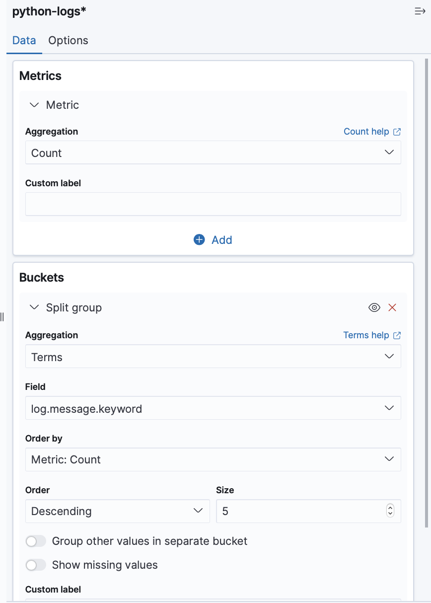
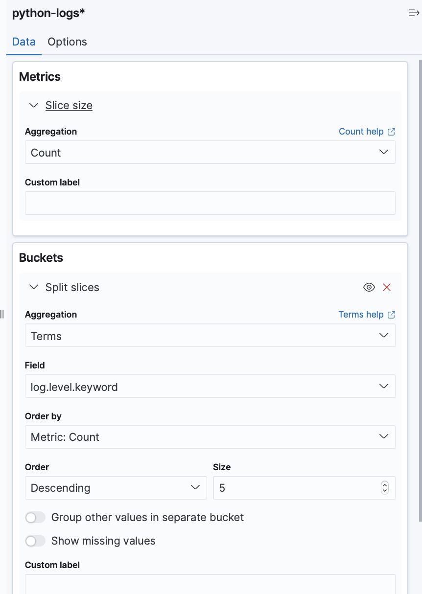
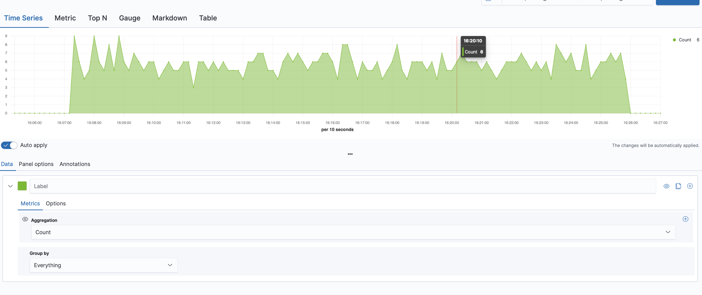
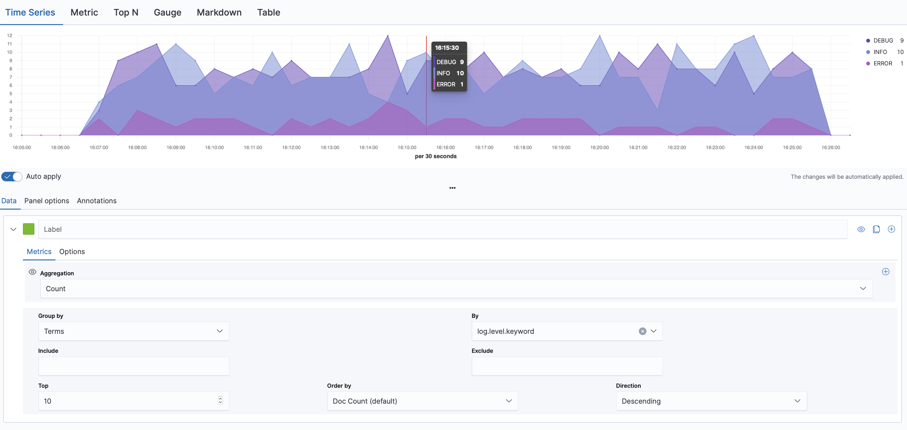
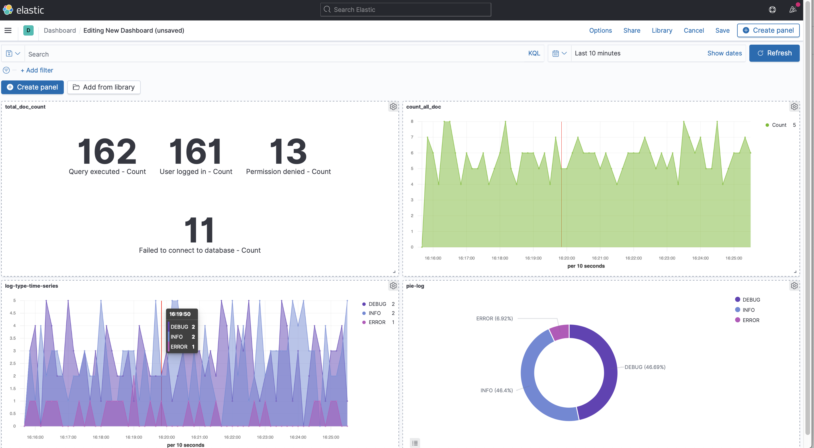

# Indexing Data with Elasticsearch and Logstash

In this tutorial, we will explore how to index data using Logstash and Elasticsearch. 

## Elasticsearch and Logstash Overview

As we've seen in the previous section, Elasticsearch is a highly scalable, distributed and RESTful search and analytics engine based on the Apache Lucene library. It enables users to store, search, and analyze large volumes of data quickly and in near real-time.

<br />

Logstash is a data processing pipeline that allows you to collect data from multiple sources, process it, and send it to your desired destination. In our case, Elasticsearch will be the destination for the processed data. Logstash  is part of the ELK stack, which also includes Elasticsearch and Kibana.

<br />

The ELK stack is a popular solution for log management and analysis. Here's how the three components work together:

- **Logstash**: Collects data from various sources (such as logs, metrics, and other events) and processes it for further analysis.
- **Elasticsearch**: Stores the processed data in a distributed search and analytics engine, allowing you to search and analyze the data in real-time.
- **Kibana**: Provides a visual interface for exploring and analyzing the data stored in Elasticsearch. It allows you to create custom dashboards and visualizations to better understand your data.

So, Logstash plays a key role in the ELK stack by collecting and processing data from various sources, and then sending it on to Elasticsearch for storage and analysis. It can perform a variety of data transformations and enrichments, such as parsing log files, filtering events, and modifying fields.
_____________________________________________________________________________________________________________________________________

## Ingest `csv` data 

In this part we will see how we can ingest csv data from a local directory through logstash and elastic. 

### Architeture overview 

```bash
├── data
│   ├── data.csv
│   └── data-json.log
├── docker-compose.yml
├── elasticsearch
│   └── elasticsearch.yml
└── logstash
    ├── logstash.conf
    └── logstash.yml
```


### Set up 
Create a new directory for your ELK stack project and navigate to it:
```bash
mkdir elk-csv && cd elk-csv
```

#### Docker-compose ELK stack

We will start our ELK stack with docker-compose, using Docker for practice has some advantages over installing it locally. 

1. Portability: Docker provides an easy way to package the entire ELK stack into a container, making it easy to move the stack between different environments or share it with others. This portability means you can easily move the stack from your local development environment to a production environment without any compatibility issues.
2. Isolation: With Docker, each container runs in an isolated environment, meaning you can run multiple versions of the ELK stack on the same machine without any conflicts. This isolation also makes it easier to debug issues since each container runs independently of the host system.
3. Easy management: Docker provides a simple way to manage the entire ELK stack with a single command. You can start, stop, and restart the stack with just a few Docker commands, making it easy to manage and maintain the stack.

Create a new docker-compose.yml file:

```yaml title="docker-compose.yml"
version: "3"
services:
  elasticsearch:
    image: elasticsearch:7.6.2
    container_name: elasticsearch
    hostname: elasticsearch
    restart: always
    environment:
      - "discovery.type=single-node"
    ports:
      - 9200:9200
      - 9300:9300
    networks:
      - dockerelk
    volumes:
      - ./elasticsearch/elasticsearch.yml:/usr/share/elasticsearch/config/elasticsearch.yml

  logstash:
    image: logstash:7.6.2
    container_name: logstash
    hostname: logstash
    ports:
      - 9600:9600
      - 8089:8089
    restart: always
    links:
      - elasticsearch:elasticsearch
    depends_on:
      - elasticsearch
    networks:
      - dockerelk
    volumes:
      - ./logstash/logstash.yml:/usr/share/logstash/config/logstash.yml
      - ./logstash/logstash.conf:/usr/share/logstash/pipeline/logstash.conf

  kibana:
    image: kibana:7.6.2
    container_name: kibana
    environment:
      - ELASTICSEARCH_HOSTS=http://elasticsearch:9200
    ports:
      - "5601:5601"
    networks:
      - dockerelk
    depends_on:
      - elasticsearch

networks:
  dockerelk:
    driver: bridge
```

Like in the Elasticsearch section, this docker-compose file is used to set up an ELK (Elasticsearch, Logstash, and Kibana). Each service (Elasticsearch, Logstash, and Kibana) is defined as a separate container.

**Elasticsearch**:

- This service uses the official Elasticsearch Docker image version 7.6.2.
- The container name and hostname are both set to "elasticsearch".
- The "restart: always" option ensures that the container is automatically restarted if it crashes or is stopped.
- The "environment" section sets the "discovery.type" to "single-node", which tells Elasticsearch to configure itself as a single node cluster.
- The "ports" section maps the container's port 9200 and 9300 to the same ports on the host machine, so that Elasticsearch can be accessed through these ports.
- The "networks" section specifies that this container should be connected to the "dockerelk" network.
- The "volumes" section maps the local "elasticsearch.yml" file to the container's Elasticsearch configuration directory, so that - any changes made to this file will be reflected in the container.


**Logstash**:

- This service uses the official Logstash Docker image version 7.6.2.
- The container name and hostname are both set to "logstash".
- The "ports" section maps the container's port 9600 and 8089 to the same ports on the host machine, so that Logstash can be accessed through these ports.
- The "restart: always" option ensures that the container is automatically restarted if it crashes or is stopped.
- The "links" section links this container to the Elasticsearch container by specifying its name as "elasticsearch".
- The "depends_on" section specifies that this container should not start until the Elasticsearch container has started.
- The "networks" section specifies that this container should be connected to the "dockerelk" network.
- The "volumes" section maps several local files (including the Logstash configuration file and the data files to be ingested) to the appropriate directories in the container.

**Kibana**:

- This service uses the official Kibana Docker image version 7.6.2.
- The container name is set to "kibana".
- The "environment" section sets the "ELASTICSEARCH_HOSTS" environment variable to "http://elasticsearch:9200", which tells Kibana to connect to the Elasticsearch container.
- The "ports" section maps the container's port 5601 to the same port on the host machine, so that Kibana can be accessed through this port.
- The "networks" section specifies that this container should be connected to the "dockerelk" network.
- The "depends_on" section specifies that this container should not start until the Elasticsearch container has started.

Finally, the "networks" section defines the "dockerelk" network as a bridge network, which allows the containers to communicate with each other.

<br />

In summary, this docker-compose file defines a complete ELK stack that can be started with a single command, using Docker containers. The three containers are connected to a bridge network, and the required configuration files and data files are mapped to the appropriate directories in each container. This allows the ELK stack to be easily deployed and managed in a consistent and reproducible way.

### Elasticsearch configuration

First, let's create a configuration file for an Elasticsearch node for our index data. An Elasticsearch configuration file is a text file that contains various settings and parameters that control the behavior of an Elasticsearch node. This file is typically named `elasticsearch.yml` and is often located in the config directory of the Elasticsearch installation.

<br />

The configuration file allows Elasticsearch administrators to control a wide range of settings, including network settings, cluster settings, logging settings, security settings, and more. 

```bash
mkdir elasticsearch && cd elasticsearch
touch elasticsearch.yml
```

Here let's create a very simple configuration file : 

```yml title="elasticsearch.yml"
cluster.name: docker-cluster
node.name: docker-node
node.master: true
network.host: 0.0.0.0
```
Let's explain these variables : 

- `cluster.name`: This specifies the name of the Elasticsearch cluster that this node will join. In this case, the cluster name is docker-cluster.
- `node.name`: This specifies the name of the Elasticsearch node itself. In this case, the node name is docker-node.
node.master: This specifies whether this node is eligible to be elected as the master node of the Elasticsearch cluster. In this case, it is set to true, meaning that this node can be elected as the master node.
- `network.host`: This specifies the network interface that the Elasticsearch node will bind to. In this case, it is set to 0.0.0.0, which means that the node will bind to all available network interfaces. This allows the node to accept connections from any IP address.

Overall, this configuration is specifying that the Elasticsearch node should join the docker-cluster cluster, with the name docker-node. It is also set to be eligible to become the master node, and will accept connections from any IP address.
You can 
### Logstash configuration

The first step is to create a Logstash configuration file that will **define how to ingest the CSV data**. For this simple example, we will use the following CSV data:

```bash
order_id,order_date,customer_name,product_name,quantity,price
1,2019-01-01,John Doe,Product A,2,100
2,2019-01-02,Jane Doe,Product B,3,200
3,2019-01-03,Bob Smith,Product C,1,50
4,2019-01-04,Jim Johnson,Product D,4,75
```

Now we need to create a Logstash configuration file according to our csv, create a new file named logstash.conf in a new directory named logstash and paste the following code:

```bash
mkdir logstash && cd logstash
touch logstash.conf
```

```lua title="logstash.conf"
input {
  file {
    path => "/usr/share/logstash/external-data/data.csv"
    start_position => "beginning"
    sincedb_path => "/dev/null"
  }
}

filter {
  csv {
    separator => ","
    columns => ["order_id", "order_date", "customer_name", "product_name", "quantity", "price"]
  }

  date {
    match => ["order_date", "yyyy-MM-dd"]
    target => "order_date"
  }
}

output {
  elasticsearch {
    hosts => ["elasticsearch:9200"]
    index => "orders-%{+YYYY.MM.dd}"
  }
}
```
Then you can edit the `logstash.yml`

```yml
xpack.monitoring.elasticsearch.hosts: [ "http://elasticsearch:9200" ]
```

This configuration file defines the input, filter, and output for Logstash. Here is what each section does:

- **input**: Defines the input source for Logstash. In this case, we are reading data from a CSV file located at /usr/share/logstash/external-data/data.csv.
- **filter**: Defines the filter to apply to the input data. We are using the csv filter to parse the CSV data and the date filter to convert the order_date field to a proper date format.
- **output**: Defines where the filtered data should be sent. In this case, we are sending the data to Elasticsearch, and creating a new index for each day of data.

Before starting Logstash, it's always a good idea to test your configuration to make sure there are no syntax errors or other issues. You can do this by running the following command:

```bash
bin/logstash --config.test_and_exit -f /path/to/your/logstash.conf
```

In our case, we run ELK through docker, we can use `docker-compose exec` by running this command : 
```bash
docker-compose exec logstash bin/logstash --config.test_and_exit -f /usr/share/logstash/pipeline/logstash.conf
```

You should see this validation message : 
```bash
OpenJDK 64-Bit Server VM warning: Option UseConcMarkSweepGC was deprecated in version 9.0 and will likely be removed in a future release.
WARNING: An illegal reflective access operation has occurred
WARNING: Illegal reflective access by com.headius.backport9.modules.Modules (file:/usr/share/logstash/logstash-core/lib/jars/jruby-complete-9.2.9.0.jar) to method sun.nio.ch.NativeThread.signal(long)
WARNING: Please consider reporting this to the maintainers of com.headius.backport9.modules.Modules
WARNING: Use --illegal-access=warn to enable warnings of further illegal reflective access operations
WARNING: All illegal access operations will be denied in a future release
Sending Logstash logs to /usr/share/logstash/logs which is now configured via log4j2.properties
[2023-04-02T12:07:37,710][WARN ][logstash.config.source.multilocal] Ignoring the 'pipelines.yml' file because modules or command line options are specified
[2023-04-02T12:07:38,479][INFO ][org.reflections.Reflections] Reflections took 21 ms to scan 1 urls, producing 20 keys and 40 values 
Configuration OK
[2023-04-02T12:07:38,869][INFO ][logstash.runner          ] Using config.test_and_exit mode. Config Validation Result: OK. Exiting Logstash
```
don't worry about the warnings we looking for is the `Configuration OK` message. Great now we can try this with a bigger csv 🤓


### Get the sample data  

For the next step let's download some sample data [here](https://gist.github.com/bdallard/d4a3e247e8a739a329fd518c0860f8a8) and edit the logstash configuration file according to this new data. 

```lua title="logstash.conf"
input {
        file {
                start_position => "beginning"
                path => "/usr/share/logstash/external-data/data.csv"
                sincedb_path => "/dev/null" 
        }
      }
filter {
  csv {
      columns => ["orderId","orderGUID","orderPaymentAmount","orderDate","orderPaymentType","latitude","longitude"]
  }
  mutate{
      remove_field => ["message","host","@timestamp","path","@version"]
  }
  mutate {
      convert => {
    "latitude" => "float"
    "longitude" => "float"
    }
  }
  date {
    match => [ "orderdate", "yyyy-MM-dd HH:mm:ss" ]
    target => "orderdate"
  }
  mutate {
    rename => {
      "latitude" => "[location][lat]"
      "longitude" => "[location][lon]"
    }
  }
}

output {
   elasticsearch {
    hosts => "elasticsearch:9200"
    index => "csv-data"
   }
   stdout{}
}
```

Now we can mount out data as a volume, just by adding these lines to our `docker-compose.yml` : 

```yml
service:
  ...
  logstash:
    ...
      - ./data/data.csv:/usr/share/logstash/external-data/data.csv
    ...

```

then re start the ELK architecture, now you can see our index by running this command into your terminal : 

```bash
curl -X GET "0.0.0.0:9200/csv-data/_search?q=*" | jq
```

You should see our `csv-data` index and the 10 first hit.


## Ingesting `json` data 

Like you've seen you also have json data in the link for the sample data. The cool thing here is you just have to change the `logstash.conf` file in order to support json format. 

```lua title="logstash-json.conf"
input {
    file {
        start_position => "beginning"
        path => "/usr/share/logstash/external-data/data-json.log"
        sincedb_path => "/dev/null" 
    }
}
filter {
    json {
      source => "message"
    }
    mutate{
      remove_field => ["message","host","@timestamp","path","@version"]
    }
}
output {
   elasticsearch {
    hosts => "elasticsearch:9200"
    index => "your-index-name"
   }
   stdout{}
}
```

Then we can mount out data as a volume, just by adding these lines to our `docker-compose.yml` : 
```yml
service:
  ...
  logstash:
    ...
      - ./data/data-json.log:/usr/share/logstash/external-data/data-json.log
    ...

```

Congrats you know now how to configurate Logstash for file data ingestion such as csv and json 🥳

____________________________________________________________________________________________________________________________________

## Data ingestion pipeline for apache web server logs processing

In this part, we will write a data ingestion pipeline to process apache web server logs with our Logstash service and visualize them using Kibana. This mini project will help you gain hands-on experience with the Elastic Stack by processing real-world data.

### Project architecture overview

```bash
.
├── data
│   └── apache_logs.txt
├── docker-compose.yml
├── logstash
│   └── logstash.conf
```

### Download Sample Web Server Logs

First, download a sample web server log file from the following link:

[Sample Web Server Log](https://raw.githubusercontent.com/elastic/examples/master/Common%20Data%20Formats/apache_logs/apache_logs)

Save the file as apache_logs.txt in a new directory for this project.

### Set Up Logstash

Open `logstash.conf` in a text editor and add the following configuration:

```lua
input {
  file {
    path => "/data/apache_logs.txt"
    start_position => "beginning"
    sincedb_path => "/dev/null"
  }
}

filter {
  grok {
    match => { "message" => "%{COMBINEDAPACHELOG}" }
  }
  date {
    match => [ "timestamp", "dd/MMM/yyyy:HH:mm:ss Z" ]
    target => "@timestamp"
    remove_field => "timestamp"
  }
  geoip {
    source => "clientip"
  }
}

output {
  elasticsearch {
    hosts => ["elasticsearch:9200"]
    index => "web_server_logs"
  }
}
```

Replace `/data/apache_logs.txt` with the actual path to the `apache_logs.txt` file if you have changed the architecture.

### Update Docker Compose Configuration

Update your docker-compose.yml file to include the new Logstash configuration file for the web server logs:

```yaml
logstash:
  # ...
  volumes:
    # ...
    - ./web_server_logs/logstash-apache.conf:/usr/share/logstash/pipeline/logstash-apache.conf
    - /data/apache_logs.txt:/apache_logs.txt
  # ...
```
Replace `/data/apache_logs.txt` with the actual path to the `apache_logs.txt` file.

#### Restart the Logstash container to apply the new configuration:

```bash
docker-compose down
docker-compose up -d
```

### Visualize Web Server Logs in Kibana

Open Kibana in your web browser by navigating to [http://localhost:5601](http://localhost:5601).

### Create a new index pattern named web_server_logs.
Go to the `Discover` tab in the left sidebar to explore the indexed data.

To create visualizations for the web server logs, follow these steps:

1. Go to the "Visualize" tab in the left sidebar and click the "Create visualization" button.
2. Select a visualization type, such as "Pie" or "Vertical bar."
3. Choose the web_server_logs index pattern as the data source.
4. Create various visualizations based on different aspects of the web server logs, such as:

    - HTTP response status codes (use the response field)
    - Top client IP addresses (use the clientip field)
    - Most frequently requested resources (use the request field)
    - Number of requests over time (use the @timestamp field)
    - Geographic distribution of client IP addresses (use the geoip.location field)


____________________________________________________________________________________________________________________________________

## Ingest real time - stream logs with ELK

In this section, we will walk you through setting up a complete ELK stack, which includes Elasticsearch, Logstash, and Kibana. We will be using Filebeat and a python script in order to simulate real time stream logs to send to Logstash and then ingest data into Elasticsearch using Logstash. Lastly, we will visualize the data using Kibana and create a dashboard.


### Architeture overview 

```bash
.
├── docker-compose.yml
├── filebeat
│   └── filebeat.yml
├── logs
│   └── python_logs.log
├── logstash
│   └── logstash.conf
└── send_logs.py
```

### Set up 
Create a new directory for your ELK stack project and navigate to it:
```bash
mkdir elk-stack && cd elk-stack
```

#### Create a stream log event with python 

Here we want to create a Python script that sends a stream of sample logs data to Logstash, which processes the data and makes it available for real-time analytics in Kibana. For this this example, we will use the Python socket library to send sample log data to Logstash over Filebeat. 

<br />

Let's start by writing our python script to write our sample logs to a local file, and let Filebeat pick them up and send them to Logstash :

```python title="send_logs.py"

import json
import socket
import time
import random
import os

#sample log messages
sample_logs = [
    {"level": "INFO", "message": "User logged in", "user_id": 1},
    {"level": "DEBUG", "message": "Query executed", "user_id": 3},
]
error_logs = [
    {"level": "ERROR", "message": "Failed to connect to database", "user_id": 2},
    {"level": "ERROR", "message": "Permission denied", "user_id": 4},
]
# local set up 
LOGS_DIR = "./logs"
LOG_FILE = "python_logs.log"

#write log into local file 
def send_log(log):
    if not os.path.exists(LOGS_DIR):
        os.makedirs(LOGS_DIR)

    with open(os.path.join(LOGS_DIR, LOG_FILE), "a") as f:
        f.write(json.dumps(log) + "\n")
        print(f"Sent log: {log}")


def simulate_log_stream():
    while True:
        if random.random() < 0.1:
            log = random.choice(error_logs)
        else:
            log = random.choice(sample_logs)

        send_log(log)
        print(log)
        time.sleep(random.uniform(0.5, 3))

if __name__ == "__main__":
    simulate_log_stream()

```

In this script we send randomly sample log data to Logstash via saving them into a local file with a 10% chance of sending error logs. Now we have to set up a docker ELK stack in order to get and process these logs.

#### Docker-compose ELK stack

Create a new docker-compose.yml file:
```yaml title="docker-compose.yml"
version: '2.2'

services:
  elasticsearch:
    image: docker.elastic.co/elasticsearch/elasticsearch:7.11.1
    container_name: elasticsearch
    environment:
      - discovery.type=single-node
      - ES_JAVA_OPTS=-Xms16g -Xmx16g
      - xpack.security.http.ssl.enabled=false
      - xpack.security.transport.ssl.enabled=false
      - xpack.security.enabled=false
    ports:
      - "9200:9200"
      - "9300:9300"
    networks:
      - elk

  logstash:
    image: docker.elastic.co/logstash/logstash:7.11.1
    container_name: logstash
    volumes:
      - ./logstash/logstash.conf:/usr/share/logstash/pipeline/logstash.conf
    ports:
      - "5044:5044"
      - "5045:5045"
      - "9600:9600"
    networks:
      - elk
    depends_on:
      - elasticsearch

  kibana:
    image: docker.elastic.co/kibana/kibana:7.11.1
    container_name: kibana
    environment:
    - ELASTICSEARCH_HOSTS=http://elasticsearch:9200
    - ELASTICSEARCH_USERNAME=elastic
    - ELASTICSEARCH_PASSWORD=password
    ports:
      - "5601:5601"
    networks:
      - elk
    depends_on:
      - elasticsearch

  filebeat:
    image: docker.elastic.co/beats/filebeat:7.11.2
    container_name: filebeat
    volumes:
      - ./filebeat/filebeat.yml:/usr/share/filebeat/filebeat.yml
      - ./logs:/logs
    networks:
      - elk
    depends_on:
      - logstash
      - elasticsearch

networks:
  elk:
    driver: bridge
```

### Configure Filebeat and Logstash

Filebeat is a **lightweight data shipper that is used to collect, process, and forward log data to Elasticsearch or Logstash**. It is designed to be simple and efficient, and can be used to centralize the collection of logs from multiple sources across your infrastructure.

<br />

The main role of Filebeat in the ELK stack is to act as a log shipper that collects and sends log data to either Elasticsearch or Logstash. It can be used to gather log data from a variety of sources, including log files, system logs, network logs, and event logs, among others.

<br />

Filebeat is often used in conjunction with Logstash, as Logstash can provide additional processing and filtering capabilities for the incoming log data before it is stored in Elasticsearch. For example, Logstash can be used to parse incoming log messages, extract fields, and enrich the data with additional context before sending it to Elasticsearch.

<br />

We'll use Filebeat in our example to send the script produced logs to Logstash. First, let's write our configuration file for Filebeat:

```bash
touch filebeat.yml
```
Open `filebeat.yml` in your favorite text editor and add the following configuration:

```yaml
filebeat.inputs:
- type: log
  enabled: true
  paths:
    - /logs/*.log

output.logstash:
  hosts: ["logstash:5045"]
```

Now, let's configure Logstash for json ingestion. Ineed because we send our logs in json format with python.
First, we need to create a Logstash configuration file:

```bash
touch logstash.conf
```

Open `logstash.conf` in a text editor and add the following configuration:

```lua
input {
  beats {
    port => 5045
  }
}

filter {
  json {
    source => "message"
    target => "log"
  }
}

output {
  elasticsearch {
    hosts => ["elasticsearch:9200"]
    index => "python-logs-%{+YYYY.MM.dd}"
  }
  stdout {
    codec => rubydebug
  }
}
```

### Process stream data with Elastic and Kibana

Run the Python script to start sending sample log data to Logstash:

```bash
python send_logs.py
```
Verify your elastic cluster is up by running the following command in an other terminal : 

```bash 
curl http://0.0.0.0:9200
```

You should see the following response, it means your Elastic cluster is up and running : 

```bash 
{
  {
  "name" : "9e18531663e6",
  "cluster_name" : "docker-cluster",
  "cluster_uuid" : "7NZ-LiVhRXyOV-LSH1Vk7A",
  "version" : {
    "number" : "7.11.1",
    "build_flavor" : "default",
    "build_type" : "docker",
    "build_hash" : "ff17057114c2199c9c1bbecc727003a907c0db7a",
    "build_date" : "2021-02-15T13:44:09.394032Z",
    "build_snapshot" : false,
    "lucene_version" : "8.7.0",
    "minimum_wire_compatibility_version" : "6.8.0",
    "minimum_index_compatibility_version" : "6.0.0-beta1"
  },
  "tagline" : "You Know, for Search"
}
```

We can also check if the index of our python log data has been created by running this command into your terminal :

```bash
curl http://0.0.0.0:9200/_cat/indices?v
```

You should see in your terminal : 

```bash
health status index                           uuid                   pri rep docs.count docs.deleted store.size pri.store.size
green  open   .apm-custom-link                ooiOfqILRle56O66Im9n2w   1   0          0            0       208b           208b
green  open   .kibana-event-log-7.11.1-000001 s8iSoKawTfyZwHE0MPNVYw   1   0          1            0      5.6kb          5.6kb
green  open   .kibana_task_manager_1          xaFul7GiSHCR6yXXeUxJ6g   1   0          8          663    125.1kb        125.1kb
yellow open   python-logs-2023.03.31          B97uqvZ-Rtqh4FjuKr4Czw   1   1       2817            0    320.3kb        320.3kb
green  open   .apm-agent-configuration        cZ86_KEyQXevPm31lf48zw   1   0          0            0       208b           208b
green  open   .async-search                   7Ks0qLUERVuWYJFMLi05GA   1   0          0            0      9.6kb          9.6kb
green  open   .kibana_1                       -UhYW3IRSbKqsQqfInPTFQ   1   0         48           21      2.1mb          2.1mb
```

This line means that our log has been processed well and it is now an elasticsearch index 

```bash
yellow open   python-logs-2023.03.31          B97uqvZ-Rtqh4FjuKr4Czw   1   1       2817            0    320.3kb        320.3kb
```

We can now log into kibana and interact with our index in your browser at [http://localhost:5601](http://localhost:5601) 

<br />

Go to the `deev tool` interface inside the `Managment` section of the menu then we can perform some queries on our python-log index. 

### Queries, sorting and pagination 

#### Get index and document 
Like before we can visualize all our indexed data by typing this command into our dev tool kibana interface : 

```bash
GET _cat/indices?v
```

You can also get all the index document by running : 

```bash
GET /python-logs-2023.03.31/_search
```

Now let's retrieve the last 5 added documents from our `python-logs-2023.03.31` index:

```bash
GET /python-logs-2023.03.31/_search
{
  "query": {
    "match_all": {}
  },
  "sort": [
    {
      "@timestamp": {
        "order": "desc"
      }
    }
  ],
  "size": 5
}
```

We can also search for documents within the specified datetime range in the "python-logs-2023.03.31" index like this : 

```bash
GET python-logs-2023.03.31/_search
{
  "query": {
    "bool": {
      "must": [
        {
          "range": {
            "@timestamp": {
              "gte": "2023-03-31T16:45:00",
              "lte": "2023-03-31T16:55:00"
            }
          }
        }
      ]
    }
  }
}
```

This query uses a range query to filter the documents based on the `@timestamp` field. The `gte` and `lte` parameters specify the range to search within. You can adjust the `datetime` values as needed to search within a different range.

#### Mapping 

Mapping is the process of defining how a document and its fields are stored and indexed in Elasticsearch. It includes specifying the data type (e.g., text, keyword, date) and configuring indexing options for each field.

<br />

To create an index with custom mapping, use the following command:

```bash
PUT /my_index
{
  "settings": {
    "number_of_shards": 3,
    "number_of_replicas": 2
  },
  "mappings": {
    "properties": {
      "field1": { "type": "text" },
      "field2": { "type": "keyword" },
      "field3": { "type": "date" }
    }
  }
}
```

You can get the automatic mapping of our created index by typing :

```bash 
GET /python-logs-2023.03.31/_mapping
```
Do not forget to replace `python-logs-2023.03.31` by your index name. You should see something like this in your kibana dev tool output console. 

```bash
{
  "python-logs-2023.03.31" : {
    "mappings" : {
      "properties" : {
        "@timestamp" : {
          "type" : "date"
        },
        "@version" : {
          "type" : "text",
          "fields" : {
            "keyword" : {
              "type" : "keyword",
              "ignore_above" : 256
            }
          }
        },
        "agent" : {
          "properties" : {
            "ephemeral_id" : {
              "type" : "text",
              "fields" : {
                "keyword" : {
                  "type" : "keyword",
                  "ignore_above" : 256
                }
              }
            },
            "hostname" : {
              "type" : "text",
              "fields" : {
                "keyword" : {
                  "type" : "keyword",
                  "ignore_above" : 256
                }
              }
            },
            "id" : {
              "type" : "text",
              "fields" : {
                "keyword" : {
                  "type" : "keyword",
                  "ignore_above" : 256
                }
              }
            },

            ...
```

#### Pagination 

Pagination is the process of breaking down a large result set into smaller, more manageable chunks or pages. In Elasticsearch, pagination is used when the number of hits returned by a search query is larger than a specified size, which is the maximum number of hits to return in a single response.

<br />

For example, if you perform a search on the `python-logs` index, and the search returns 1000 hits, it might not be practical to display all 1000 hits at once. In such cases, pagination allows you to retrieve the hits in smaller chunks or pages, typically 10, 20, or 50 hits at a time, depending on your configuration.

<br />

There are several benefits to using pagination in Elasticsearch, including:

- **Faster response times**: Retrieving a smaller set of results at a time can help to reduce the response time of your queries. This is particularly important for large indexes with lots of data.
- **Improved user experience**: Displaying a large number of hits on a single page can be overwhelming for users. Pagination allows you to present the data in a more manageable way, improving the user experience.
- **Reduced resource usage**: When you limit the number of hits returned in a single response, you can reduce the amount of memory and network bandwidth required to handle the response.

In your case, since you have a large number of logs in your `python-logs` index, it might be practical to use pagination to retrieve the logs in smaller chunks. This will help to improve the performance of your queries and provide a better user experience.

<br />

For your information, elasticsearch returns the top 10 results by default. To paginate through the results, you can use the "from" and "size" parameters:

```bash
GET /my_index/_search
{
  "query": { ... },
  "from": 10,
  "size": 10,
  "sort": [ ... ]
}
```

In this example, "from" is the starting document index, and "size" is the number of documents to return, let's practice on our `python-log` index 🤓

##### Pagination using a simple match query

```bash
GET python-logs/_search
{
  "query": {
    "match": {
      "message": "error"
    }
  },
  "size": 10,
  "from": 0
}
```
This will return the first 10 results that match the query "error" in the message field.

<br />

To get the next 10 results, you would set "from": 10 in the query.

##### Pagination using a range query on a date field
```bash
GET python-logs/_search
{
  "query": {
    "range": {
      "@timestamp": {
        "gte": "2023-03-31T16:45:00",
        "lte": "2023-03-31T16:55:00"
      }
    }
  },
  "size": 10,
  "from": 0
}
```

This will return the first 10 results that have a timestamp between 16:45:00 and 16:55:00 on March 31st, 2023.
Same thing, to get the next 10 results, you would set "from": 10 in the query.

##### Pagination using a terms query and sorting by a numeric field
```bash
GET python-logs/_search
{
  "query": {
    "terms": {
      "log.level": ["error", "warning"]
    }
  },
  "sort": [
    {"log.user_id": "asc"}
  ],
  "size": 10,
  "from": 0
}
```

This will return the first 10 results that have a log.level of `error` or `warning`, sorted by the `log.user_id` field in ascending order.

_____________________________________________________________________________________________________________________________________

## Visualizing real time data in Kibana

### Create index pattern 

In Elasticsearch, an index is a collection of documents that have somewhat similar characteristics. It is used to store and search data. An index pattern, on the other hand, is a way to define the name of an index or a set of indexes that Kibana should use to retrieve data from Elasticsearch.

<br />

When Kibana connects to Elasticsearch, it needs to know which index to search for data. This is where index patterns come into play. An index pattern tells Kibana which index or set of indexes it should use to retrieve data from Elasticsearch.

<br />

Index patterns can be defined using wildcards, which allow for more flexibility in naming indexes. For example, you could define an index pattern that matches all indexes that start with "logstash-", such as "logstash-*". This would allow Kibana to search for data across all indexes that match the pattern, regardless of their specific names.

<br />

Index patterns are important because they allow Kibana to map data to visualizations, dashboards, and searches. When you create a visualization or dashboard in Kibana, you need to specify which index pattern the data should come from. This allows Kibana to retrieve the data from Elasticsearch and display it in the appropriate visualizations.

<br />

Overall, index patterns are a crucial part of the Kibana interface, as they allow users to easily search, visualize, and analyze data stored in Elasticsearch.

<br />

Let's create the index pattern we need : 

1. Open Kibana in your web browser by navigating to [http://localhost:5601](http://localhost:5601)
2. Go to the `Stack Management` tab in the left sidebar and click on the `Kibana` section on `Index Patterns`
3. Click the `Create index pattern` button
4. Enter the `Index pattern name`, four our case let's enter `python-logs*` field and click `Next`
5. Select the `@timestamp` field as the `Time Filter field name` and click `Create index pattern`


### Build a Dashboard with our indexed data 

Now that we have our index reconize by Kibana let's create some graphics

1. On the menu through the Kibana section go to the `Discover` tab in the left sidebar to explore your indexed data, you can notice that you can change the time interval with the calendar button on the top right. This is just a general visualization grah of our data, you can refresh it and see the data from our python script in real time.
2. To create visualizations and dashboards, go to the `Dashboard` section in the left sidebar then click on the `+ Create panel` button 
3. Choose `Aggregation based` option > `metrics` then choose our `python-logs` index then enter the options on the images bellow :

Then you can save the graph and retreive it into the `visualize` section into the top left menu. 

4. Now we will create a pie chart graph based on the same logic, go to `Aggregation based` graph > `pie` then choose our `python-logs` index then enter the options on the images bellow :


5. Now let's create a time series graph : just go to `TSVB` it will automatically disply the count of your doc by 30s range interval. 


6. Let's now filter our time series graph, create an other panel juste like before and add the following settings : 


And this is it, congrats you have build your first dashboard, you can name it and save it 🥳


Now you have successfully set up an ELK stack with Filebeat, ingested log files in real time using Logstash, and visualized the data in Kibana!

<br />

Feel free to explore Kibana's features, such as creating various types of visualizations, adding them to dashboards, and configuring alerts to stay informed about your data. Remember to monitor your Docker containers to ensure they are running smoothly 🐳


## Ingest multiple pipeline 

In this part we will see how we can ingest multiple data sources through logstash and elastic. For this let's merge the 3 pipelines we have seen before: `csv` pipeline file, `grok` pipeline and the `filebeat` pipeline 🤓

### Architeture overview 

```bash
.
├── data
│   ├── apache_logs.txt
│   ├── data.csv
│   └── data-json.log
├── docker-compose.yml
├── filebeat
│   └── filebeat.yml
├── logs
│   └── python_logs.log
├── logstash
│   ├── config
│   │   ├── logstash.yml
│   │   └── pipelines.yml
│   └── pipeline
│       ├── logstash-apache.conf
│       ├── logstash-python-log.conf
│       └── logstash-csv.conf
├── README.md
└── send_logs.py
```

### Set Up Logstash configuration files 


Now, let's take the three Logstash configuration files we have seen before. The `logstash-apache.conf` for the apache pipeline project, `logstash-csv.conf` and `logstash-python-log.conf` for the real time log project, to handle those inputs data and put them into a `pipeline` directory. 

Next, create the `pipelines.yml` file to configure the Logstash pipelines inside a directory called `config`:
```yml title="pipelines.yml"
- pipeline.id: csv-pipeline
  path.config: "/usr/share/logstash/pipeline/logstash-csv.conf"

- pipeline.id: python-pipeline
  path.config: "/usr/share/logstash/pipeline/logstash.conf"

- pipeline.id: apache-pipeline
  path.config: "/usr/share/logstash/pipeline/logstash-apache.conf"
```

and then create a `logstash.yml` file : 
```yml
path.config: /usr/share/logstash/config/pipelines.yml
```

By default, Logstash should look for a `pipelines.yml` file in the same directory as the `logstash.yml` file, this simple line tell logstash to look up for the `pipelines.yml` file in the correct location.

### Update `docker-compose.yml` file 

Next, update your `docker-compose.yml` to mount the files in the Logstash container and an environement variable to indicate the config path to Logstash :

```yml
services:
  logstash:
    
    ...
    environment:
      - LS_SETTINGS_DIR=/usr/share/logstash/config
    volumes:
      - ./logstash/pipeline:/usr/share/logstash/pipeline
      - ./logstash/config/pipelines.yml:/usr/share/logstash/config/pipelines.yml
      - ./data:/usr/share/logstash/external-data
    
    ...

```

The rest of the project remains unchanged, you can now run `docker-compose up -d` command and check if the indicies are created :

```bash
curl http://0.0.0.0:9200/_cat/indices?v
```
you should see this output : 
```bash
health status index                           uuid                   pri rep docs.count docs.deleted store.size pri.store.size
green  open   .apm-custom-link                Eww7EOhAS6aSKENm14yv4g   1   0          0            0       208b           208b
yellow open   csv-data                        1PDAef-cS82F8NP6F72Hpg   1   1       4174            0      1.4mb          1.4mb
green  open   .kibana_task_manager_1          wpmgiisqQCGuIHxhlzB6Vw   1   0          8           24     62.7kb         62.7kb
green  open   .kibana-event-log-7.11.1-000001 xk67yAl1RyuVED8h1FKuYg   1   0          1            0      5.5kb          5.5kb
green  open   .apm-agent-configuration        HS51EL_6ScO4PCwfQgD5hA   1   0          0            0       208b           208b
yellow open   web_server_logs                 tUiVljDOQICNnv_af_ystg   1   1      10000            0      6.6mb          6.6mb
green  open   .kibana_1                       ltbQgXoVTrehRy79x5yWzw   1   0          8            0      2.1mb          2.1mb
yellow open   python-logs-2023.04.07          QBqBOF88TSGNspubKMaUPg   1   1       4089            0    438.2kb        438.2kb
```

Congrat's you have set up a multiple data pipeline in ELK 🥳

____________________________________________________________________________________________________________________________________

## Conclusion

In this section we covers setting up a ELK architecture using Docker, using Filebeat with Logstash, indexing CSV, txt and json files with Logstash, and visualizing indexed data using Kibana Dashboards. 

<br />

With this knowledge, you can effectively collect, process, and visualize data with the Elasticsearch, Logstash, and Kibana stack 🥳