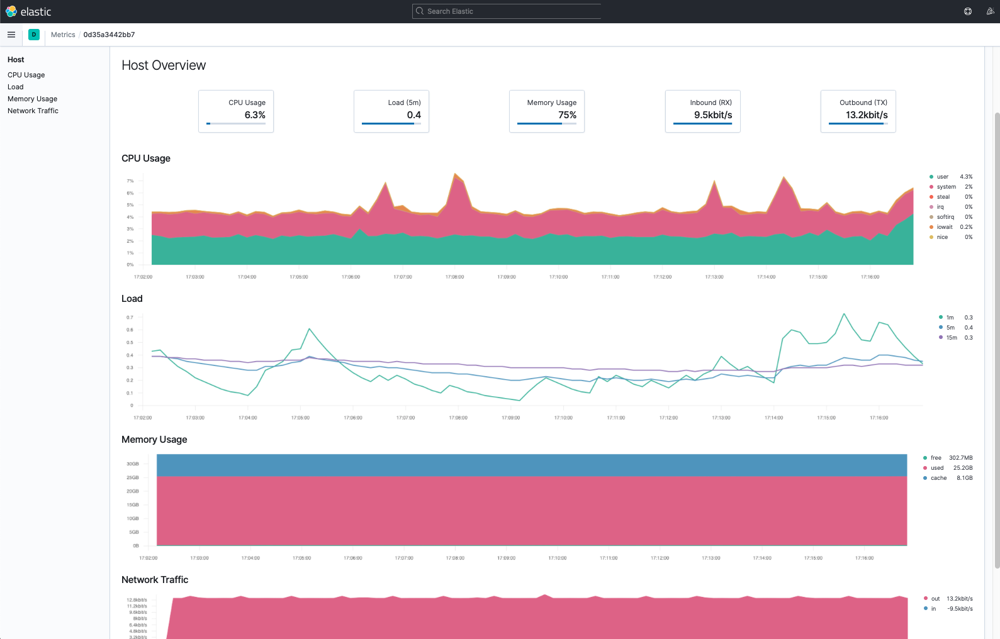
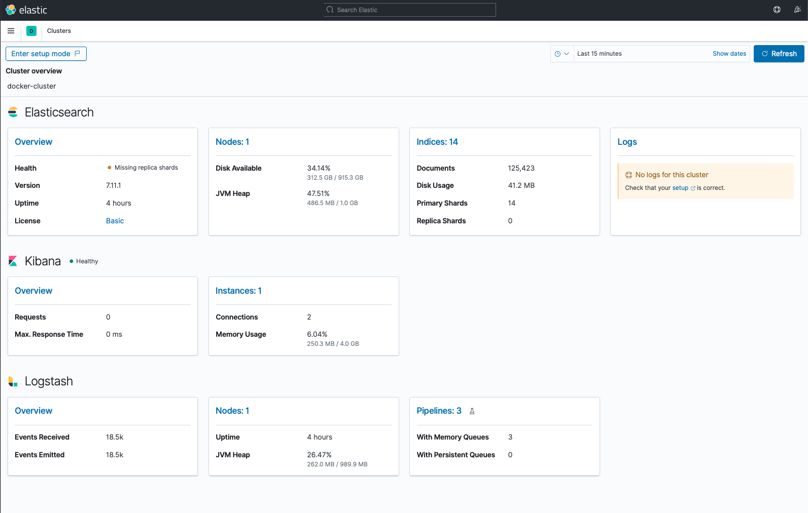
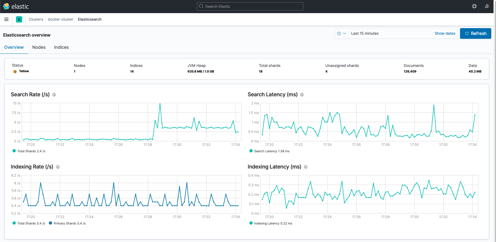
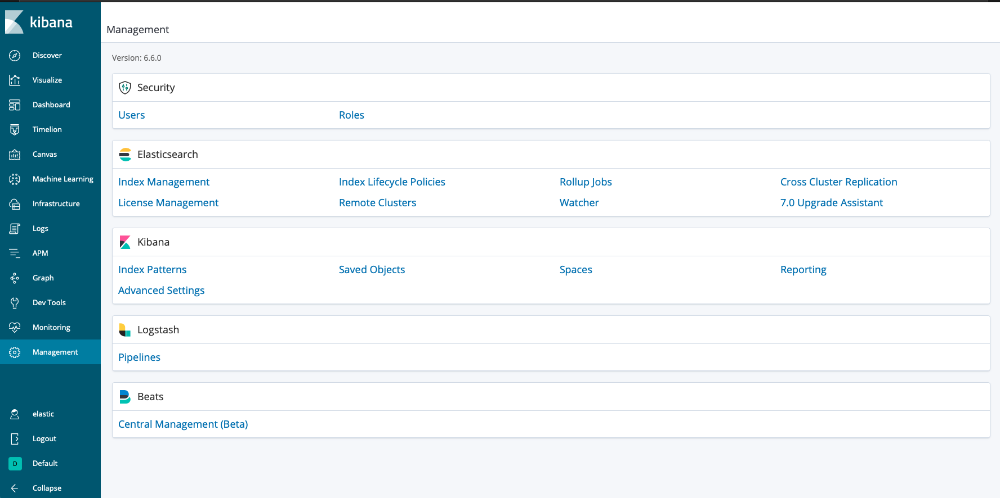
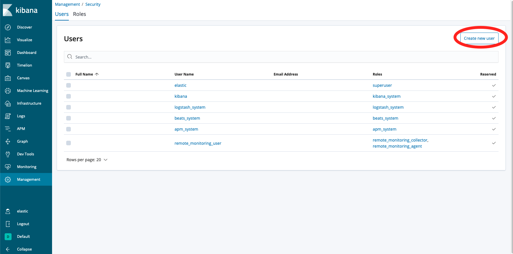

# Monitoring and Administration 

In this section we will talk about monitoring an ELK cluster and give an example monitoring architecture based on our previous docker multiple pipeline ingestion project [here](http://0.0.0.0:5005/nosql/logstash/#ingest-multiple-pipeline) with the following tree architecture : 

```bash
.
├── data
│   ├── apache_logs.txt
│   ├── data.csv
│   └── data-json.log
├── docker-compose.yml
├── filebeat
│   └── filebeat.yml
├── logs
│   └── python_logs.log
├── logstash
│   ├── config
│   │   ├── logstash.yml
│   │   └── pipelines.yml
│   └── pipeline
│       ├── logstash-apache.conf
│       ├── logstash-python-log.conf
│       └── logstash-csv.conf
├── README.md
└── send_logs.py
```

## Why monitoring 

First let's take a look at why monitoring an ELK cluster is crucial :

- **Performance Optimization**: Monitoring allows you to track the performance of your ELK cluster, including resource utilization, query latency, indexing rates, and memory usage. By monitoring these metrics, you can identify bottlenecks, optimize resource allocation, and fine-tune your cluster for better performance.
- **Proactive Issue Detection**: Monitoring helps you detect issues and anomalies in your ELK cluster before they cause significant problems. By monitoring metrics like error rates, disk space utilization, or network throughput, you can identify potential issues early and take proactive measures to prevent downtime or data loss.
- **Capacity Planning**: Monitoring enables you to forecast and plan for future capacity needs. By monitoring resource utilization trends over time, you can identify patterns and make informed decisions about scaling your cluster, adding or removing nodes, or adjusting hardware configurations.
- **Security and Compliance**: Monitoring assists in maintaining the security and compliance of your ELK cluster. By monitoring access logs, authentication events, and audit logs, you can detect suspicious activities, unauthorized access attempts, or compliance violations, allowing you to take appropriate action.

Now, let's explore the ways you can monitor an ELK cluster:

- Elasticsearch Monitoring APIs: Elasticsearch provides a set of built-in monitoring APIs that expose various metrics and statistics about the cluster's health, performance, and resource utilization. These APIs allow you to retrieve real-time and historical data programmatically.
- Elasticsearch Plugins: There are several third-party plugins available for Elasticsearch that provide enhanced monitoring capabilities. These plugins offer features like visual dashboards, alerting, anomaly detection, and more. Examples include the Elasticsearch Monitoring Plugin, X-Pack Monitoring, or Prometheus exporters.
- Metricbeat: Metricbeat is an agent or shipper that collects system and service-level metrics from servers and services. It is responsible for gathering metrics such as CPU usage, memory utilization, disk I/O, network traffic, and more. Metricbeat can be configured to send these metrics directly to Elasticsearch or other output destinations.
- External Monitoring Solutions: You can also use external monitoring tools or solutions to monitor your ELK cluster. These tools provide comprehensive monitoring capabilities, integration with other systems, advanced alerting, and reporting features. Examples of external monitoring solutions include Datadog, Grafana, Nagios, or Zabbix.

By combining multiple monitoring approaches, you can gain a comprehensive view of your ELK cluster's health, performance, and security. This allows you to proactively address issues, optimize performance, ensure compliance, and make informed decisions to maintain the reliability and efficiency of your ELK stack.

### Understand health check status

Elasticsearch's cluster health status is an important indicator of the overall status of your Elasticsearch cluster. You can check the cluster's health status by sending a GET request to `http://localhost:9200/_cluster/health`.

The health status is indicated by three colors:

- Green: Everything is good (all shards are allocated).
- Yellow: All primary shards are allocated but some or all replicas are not.
- Red: Some or all primary shards are not allocated.


## Metricbeat monitoring for docker ELK cluster

As you know monitoring is essential for ensuring the health and performance of servers, whether they are physical, VM or deployed as Docker containers. It becomes challenging to identify specific server issues and predict potential crashes when managing multiple servers in the field. This is where monitoring data becomes crucial.

Traditionally, administrators would write their own scripts or programs to collect server metrics. While this approach may work well for a small number of servers, it becomes less efficient and scalable as the number of server instances increases. Custom scripts may not easily handle multi-server monitoring or offer flexibility for monitoring different systems like operating systems, databases, and application servers.

Metricbeat, developed by Elastic, offers a comprehensive solution for collecting common server and service metrics. It provides a single executable that can ingest metrics from various sources such as the host (OS level), databases (e.g., MySQL, PostgreSQL), and message queues (e.g., Kafka, RabbitMQ). Metricbeat is actively maintained and continually updated to support different metric consumption needs.

By using Metricbeat, administrators can benefit from a pre-built solution that eliminates the need for custom scripts or programs. Instead, they can focus on maintaining configuration files that specify the desired metrics to monitor. This simplifies the monitoring process and ensures that administrators can easily gather metrics from various systems without the need for extensive code customization.

In summary, Metricbeat serves as a reliable and scalable solution for monitoring servers and services. It simplifies the collection of metrics by providing a single executable and actively supports various metric consumption needs. By using Metricbeat, administrators can efficiently monitor their systems without the burden of developing and maintaining custom monitoring scripts or programs.


### Add a metricbeat service 

First we need to add the `metricbeat` service inside our `docker-compose.yml` file. Here is the modify version of our `docker-compose.yml` file : 

```yaml title="docker-compose.yml"
version: '2.2'

services:
  elasticsearch:
    image: docker.elastic.co/elasticsearch/elasticsearch:7.11.1
    container_name: elasticsearch
    environment:
      - discovery.type=single-node
      - ES_JAVA_OPTS=-Xms1g -Xmx1g
    ports:
      - "9200:9200"
      - "9300:9300"
    volumes:
      - es-data:/usr/share/elasticsearch/data
    networks:
      - elk

  logstash:
    image: docker.elastic.co/logstash/logstash:7.11.1
    container_name: logstash
    environment:
      - LS_SETTINGS_DIR=/usr/share/logstash/config
    volumes:
      - ./logstash/pipeline:/usr/share/logstash/pipeline
      - ./logstash/config/pipelines.yml:/usr/share/logstash/config/pipelines.yml
      - ./data:/usr/share/logstash/external-data
    ports:
      - "5044:5044"
      - "5045:5045"
      - "9600:9600"
    networks:
      - elk
    depends_on:
      - elasticsearch

  kibana:
    image: docker.elastic.co/kibana/kibana:7.11.1
    container_name: kibana
    environment:
    - ELASTICSEARCH_HOSTS=http://elasticsearch:9200
    ports:
      - "5601:5601"
    networks:
      - elk
    depends_on:
      - elasticsearch

  filebeat:
    image: docker.elastic.co/beats/filebeat:7.11.2
    container_name: filebeat
    volumes:
      - ./filebeat/filebeat.yml:/usr/share/filebeat/filebeat.yml
      - ./logs:/logs
    networks:
      - elk
    depends_on:
      - logstash
      - elasticsearch


  metricbeat:
    build: ./metricbeat
    container_name: metricbeat
    volumes:
      - /var/run/docker.sock:/var/run/docker.sock
      - metricbeat-data:/usr/share/metricbeat/data
    environment:
      - ELASTICSEARCH_HOSTS=http://elasticsearch:9200
    networks:
      - elk
    depends_on:
      - elasticsearch
      - kibana

volumes:
  es-data:
    driver: local
  metricbeat-data:
    driver: local

networks:
  elk:
    driver: bridge
```

Like you have seen we added a service named `metricbeat` (very original) and declared the target elasticsearch host through an environment variable `ELASTICSEARCH_HOSTS`. Also a new volume for data storage is added for this service. Metricbeat should be on the same network as our elasticsearch cluster so we added it to the `elk` shared network. 

### Custom metricbeat image

Now let's edit our service configuration first let's modify our architecture by addind a `metricbeat` folder and a `metricbeat.yml` file inside so your architecture should be like : 

```bash
.
├── data
│   ├── apache_logs.txt
│   ├── data.csv
│   └── data-json.log
├── docker-compose.yml
├── filebeat
│   └── filebeat.yml
├── logs
│   └── python_logs.log
├── logstash
│   ├── config
│   │   ├── logstash.yml
│   │   └── pipelines.yml
│   └── pipeline
│       ├── logstash-apache.conf
│       ├── logstash.conf
│       └── logstash-csv.conf
├── metricbeat
│   ├── Dockerfile
│   └── metricbeat.yml
├── README.md
└── send_logs.py
```

Now let's take a look at the metricbeat config file here : 

```yaml 
metricbeat.config.modules:
  path: ${path.config}/modules.d/*.yml
  reload.enabled: false

metricbeat.modules:
- module: elasticsearch
  metricsets:
    - node
    - node_stats
  period: 10s
  hosts: ["elasticsearch:9200"]

setup.kibana:
  host: "kibana:5601"

output.elasticsearch:
  hosts: ["elasticsearch:9200"]
```
and the custom Dockerfile here : 

```dockerfile
FROM docker.elastic.co/beats/metricbeat:7.11.1
COPY metricbeat.yml /usr/share/metricbeat/metricbeat.yml
USER root
RUN chown root /usr/share/metricbeat/metricbeat.yml
```

Overall, this configuration sets up Metricbeat to collect metrics from Elasticsearch nodes using the specified module and metricsets. It also configures the connection to Elasticsearch and Kibana for sending the collected metrics and for the initial setup process.

Let's break it down section by section:

- `metricbeat.config.modules`:

    - `path: ${path.config}/modules.d/*.yml`: Specifies the path where the module configuration files are located. It uses the `${path.config}` variable, which typically refers to the configuration directory of Metricbeat. Here, it indicates that the module configuration files have a `.yml` extension and are located in the `modules.d` directory.
    - `reload.enabled: false`: Disables the automatic reloading of module configurations. When set to false, Metricbeat will not dynamically reload module configurations if they change. This setting is useful when you want to ensure stability and prevent potential issues during runtime.

- `metricbeat.modules`:

    - `module: elasticsearch`: Specifies that the Elasticsearch module should be enabled. This module allows Metricbeat to collect metrics from Elasticsearch.
    - `metricsets: [...]`: Specifies the specific metricsets to be collected from Elasticsearch. In this case, it collects the node and node_stats metricsets, which provide information about Elasticsearch nodes and their statistics.
    - `period: 10s`: Sets the collection period for the Elasticsearch module. Metrics will be collected every 10 seconds.
    - `hosts: ["elasticsearch:9200"]`: Specifies the Elasticsearch host(s) and port(s) to connect to for metric collection. Here, it connects to elasticsearch on port 9200. Modify this based on your Elasticsearch setup.

- `setup.kibana`:

    - `host: "kibana:5601"`: Specifies the host and port of the Kibana instance. This setting is used during the setup process to configure Metricbeat to connect to Kibana. Here, it connects to kibana on port 5601. Adjust this according to your Kibana setup.

- `output.elasticsearch`:

    - `hosts: ["elasticsearch:9200"]`: Specifies the Elasticsearch host(s) and port(s) where Metricbeat should send the collected metrics. In this case, it sends them to elasticsearch on port 9200. Adjust this based on your Elasticsearch configuration.

Now let's up the project with `docker-compose up` command and take a look if the metricbeat service is running well. 
Once Metricbeat is up and running, you can check that it's successfully collecting and sending metrics by querying your Elasticsearch cluster with this command :

```bash
curl -X GET "localhost:9200/metricbeat-*/_search?pretty"
```

This should return documents from your Metricbeat indices, not easy to read... Let's leverage Kibana in order to have those informations with a GUI 😎


### Monitoring index metrics and logs in Kibana

First thing first, as you already know we have to create an `index pattern` in order to view pretty much anything in Kibana. 

1. Open Kibana by navigating to http://<HOST_IP>:5601 in your web browser (replace <HOST_IP> by the IP of the kibana server)
2. Click on "Management" in the left navigation menu.
- Click on "Stack Management".
- Under "Kibana", click on "Index Patterns".
- Click on "Create index pattern".
- In the "Index pattern name" field, enter `metric*` and click "Next step".
- For "Time field", choose `@timestamp` and click "Create index pattern".

Now you can go in the `Metrics` section of the menu and see the following graph : 

<center>

</center>

#### Set up cluster monitoring 

Now let's take a look at our docker-ELK cluster by setting up the native cluster monitoring. 
Navigate into your kibana browser interface click on > `Stack monitoring` and choose the “self monitoring” feature. Now you should see this graph in your browser : 

<center>

</center>

You can also look at the node informations by clicking on the node section and see the following graph : 

<center>

</center>


## Maintaining an Elastic Cluster

As with any other data storage technology, Elasticsearch requires maintenance to ensure optimal performance, data integrity, and reliability. Here we will try cover three key aspects of maintaining an Elasticsearch cluster, including updating Elasticsearch versions, creating snapshots of Elasticsearch indexes, and automating Elasticsearch tasks using Curator.

### Updating Elasticsearch Versions

As time progresses, Elasticsearch versions will be updated to introduce new features, fix bugs, and improve security. Therefore, it's essential to keep your Elasticsearch instance up-to-date. Here we are using Docker so we can update the version quite easily just by updating the Elasticsearch version in the docker-compose.yml file. 

For example, if you wanted to update to version 7.15.0, you would change the image line under the elasticsearch service image. 

### Monitor the Elasticsearch logs
After the container has started, it's essential to monitor the Elasticsearch logs to ensure the update was successful and no errors occurred during startup. You can use the command : `docker-compose logs -f elasticsearch` to do this.

Remember, before performing an update, always back up your data to prevent any loss during the update process. This leads us to the next section, creating snapshots of Elasticsearch indexes.


## Backup and restoration
Backups in Elasticsearch are managed through snapshots. A snapshot is a backup taken from a running Elasticsearch cluster. You can take a snapshot of individual indices or of the entire cluster.

Snapshots provide a backup mechanism used to restore your indexes in case of data loss or corruption. Creating regular snapshots of your Elasticsearch indexes is a critical part of maintaining your Elasticsearch cluster.
You can create snapshots manually using the Elasticsearch Snapshot API or use the Elasticsearch Curator tool to automate the process.

Before creating a snapshot, you need to register a snapshot repository. This is a location where Elasticsearch will store the snapshots. This location can be a shared file system, AWS S3, Azure Storage, Google Cloud Storage, or HDFS. For this guide, we'll assume you're using a shared file system as your snapshot repository.

### Create a simple snapshot

Let's begin by creating a dummy index like this : 

```bash
curl -X PUT "localhost:9200/my_index"
```

Let's send a `POST` request to index a dummy document in `my_index` : 

```bash
curl -X POST "localhost:9200/my_index/_doc" -H 'Content-Type: application/json' -d'
{
  "message": "Hello, Elasticsearch!"
}'
```
We can verify the document is well stored by using the `search` endpoint : 
```bash
curl -X GET "localhost:9200/my_index/_search?q=message:Hello"
```

Before we can take a snapshot, we need to register a snapshot repository.
```bash 
curl -X PUT "localhost:9200/_snapshot/my_backup" -H 'Content-Type: application/json' -d'
{
  "type": "fs",
  "settings": {
    "location": "/usr/share/elasticsearch/snapshots"
  }
}
'
```
This registers a repository named my_backup of type fs (file system), pointing to the directory where the Docker volume is mounted.
So modify the `docker-compose.yml` file in the `elasticsearch` service as bellow : 

```yaml
...
    volumes:
      - es-data:/usr/share/elasticsearch/data
      - ./snapshots:/usr/share/elasticsearch/snapshots  # Add this line
...
```

and add this environement variable :
```bash
- path.repo=/usr/share/elasticsearch/snapshots
```

Ensure you have the `./snapshots` directory created in your local machine where your docker-compose file resides.
You should have the following result in your terminal/kibana console :

```bash
{
  "acknowledged" : true
}
```

Now we can finally create our snapshot with this command : 
```bash
curl -X PUT "localhost:9200/_snapshot/snapshots/snapshot_1?wait_for_completion=true"
```

You should have the following response : 

```bash
{
  "snapshot" : {
    "snapshot" : "snapshot_1",
    "uuid" : "nhqXdwiRTz6Wi-bnKZe6BA",
    "version_id" : 7110199,
    "version" : "7.11.1",
    "indices" : [
      ".apm-custom-link",
      ".ds-ilm-history-5-2023.05.14-000001",
      ".kibana_security_session_1",
      "metricbeat-7.11.1-2023.05.14-000001",
      ".monitoring-kibana-7-2023.05.14",
      ".kibana_1",
      ".monitoring-logstash-7-2023.05.14",
      ".kibana-event-log-7.11.1-000001",
      ".async-search",
      "csv-data",
      "web_server_logs",
      ".monitoring-es-7-2023.05.14",
      ".apm-agent-configuration",
      ".security-7",
      "python-logs-2023.05.14",
      ".kibana_task_manager_1"
    ],
    "data_streams" : [
      "ilm-history-5"
    ],
    "include_global_state" : true,
    "state" : "SUCCESS",
    "start_time" : "2023-05-14T19:48:24.587Z",
    "start_time_in_millis" : 1684093704587,
    "end_time" : "2023-05-14T19:48:27.805Z",
    "end_time_in_millis" : 1684093707805,
    "duration_in_millis" : 3218,
    "failures" : [ ],
    "shards" : {
      "total" : 16,
      "failed" : 0,
      "successful" : 16
    }
  }
}

```
You can now verify the snapshot by getting informations about `snapshot_1` with this command:

```bash
curl -X GET "localhost:9200/_snapshot/my_backup/snapshot_1"
```

You should see information pretty much the same output as before. 
__________________________________________________________________________________________

## Curator tool 

Elasticsearch Curator is a tool from Elastic that **helps you manage your Elasticsearch indices and snapshots**. With Curator, you can schedule tasks that do things like delete old indices, optimize indices, create new indices, or snapshot your cluster.

### Add Curator to our Docker Compose stack

```yaml
curator:
  image: bobrik/curator:5.8.1
  volumes:
    - ./curator:/etc/curator
  command:
    - --config
    - /etc/curator/config.yml
    - /etc/curator/actions.yml
  networks:
    - elk
```

In our example, we are using the `bobrik/curator` Docker image, which includes Elasticsearch Curator. We're also mounting a local curator directory to the `/etc/curator` directory in the container, where we'll store Curator's configuration and action files like we have done before.

### Create Curator configuration directory and files

Next, you'll need to create a curator directory in the same directory as our docker-compose file, and inside it, create two files: `config.yml` and `actions.yml`.

The `config.yml` file will contain the connection configuration for Curator to connect to your Elasticsearch instance in our case let's connect to our Elastic cluster without security feature in order to understund a simple example. 

```yaml
---
client:
  hosts:
    - elasticsearch
  port: 9200
  url_prefix:
  use_ssl: False
  certificate:
  client_cert:
  client_key:
  ssl_no_validate: False
  http_auth:
  timeout: 30
  master_only: False

logging:
  loglevel: INFO
  logfile:
  logformat: default
  blacklist: ['elasticsearch', 'urllib3']
```

Now the `actions.yml` file will contain the actions that Curator will perform. Let's write a very simple example that deletes indices older than 30 days:

```yaml
---
actions:
  1:
    action: delete_indices
    description: >-
      Delete indices older than 30 days (based on index name), for logstash-
      prefixed indices. Ignore the error if the filter does not result in an
      actionable list of indices (ignore_empty_list) and exit cleanly.
    options:
      ignore_empty_list: True
      disable_action: False
    filters:
    - filtertype: pattern
      kind: prefix
      value: logstash-
    - filtertype: age
      source: name
      direction: older
      timestring: '%Y.%m.%d'
      unit: days
      unit_count: 30
```

Remember to adjust the hosts value in `config.yml` and the filters in `actions.yml` to fit your needs if you are not running the ELK stack on docker.

### Running our Curator Job test

With these two files in place, now we can start our Curator service with the simple bash command :

```bash
docker-compose up -d curator
``` 

Curator will start and perform the actions defined in our file `actions.yml` then delete the old indicies.  
In this example our Curator service is very simple, if we want to run Curator periodically, we can modify the command in the Curator service to run it at intervals. We can also use something like sleep commands in a infite loop, or use a more advanced tool like cron or supervisord to schedule the Curator command. 


Or we can simply run the Curator service manually whenever we want to perform actions 🤓

__________________________________________________________________________________________

## X-Pack Security overview 

As we seen, X-Pack is a feature of Elasticsearch and Kibana, providing a range of security capabilities that safeguard your data. X-Pack security features include encryption, role-based access control, IP filtering, and audit logging. This article will introduce you to X-Pack security, focusing on managing users and roles, preventing intrusions and data tampering, and tracing all activities.


### Enable X-Pack in Docker stack 
First let's modify our Elasticsearch and Kibana service by adding some environement variables and a configuration file for the kibana service. Let's write the `docker-compose.yml` file like this : 

```yaml
version: '2.2'

services:
  elasticsearch:
    image: docker.elastic.co/elasticsearch/elasticsearch:7.11.1
    container_name: elasticsearch
    environment:
      - discovery.type=single-node
      - ES_JAVA_OPTS=-Xms1g -Xmx1g
      - xpack.security.enabled=true
      - xpack.security.audit.enabled=true
      - xpack.monitoring.collection.enabled=true
      - ELASTIC_PASSWORD=somethingsecret
    ports:
      - "9200:9200"
      - "9300:9300"
    volumes:
      - es-data:/usr/share/elasticsearch/data
      #enable HTTPS
      #- ./certs:/usr/share/elasticsearch/config/certs  
    healthcheck:
      test: ["CMD", "curl", "-f", "http://localhost:9200/"]
      interval: 30s
      timeout: 10s
      retries: 5 
    networks:
      - elk
...

  kibana:
    image: docker.elastic.co/kibana/kibana:7.11.1
    container_name: kibana
    environment:
      - ELASTICSEARCH_URL=http://elasticsearch:9200
    ports:
      - "5601:5601"
    volumes:
      - ./kibana/kibana.yml:/usr/share/kibana/config/kibana.yml:ro
    networks:
      - elk
    depends_on:
      - elasticsearch
    healthcheck:
      test: ["CMD", "curl", "-f", "http://localhost:5601/"]
      interval: 30s
      timeout: 10s
      retries: 5
...

```
You can notice that we are using an `healthcheck` in order to improve our user experience. Then write the `kibana.yml` file here : 

```yaml title="kibana.yml"
server.host: "0.0.0.0"
elasticsearch.hosts: [ "http://elasticsearch:9200" ]
monitoring.ui.container.elasticsearch.enabled: true
elasticsearch.username: elastic
elasticsearch.password: somethingsecret
```

Then you restart your stack, in the case of you already have a running stack you can kill it with the followind command : 

```bash
docker-compose down --remove-orphans && docker-compose up -d
```

You can also notice that we have created a user in our `elasticsearch` service inside our `docker-compose.yml` above in order to connect our stack. By the way the default user name is `elastic`. 


### Manage Users and Roles

Managing users and roles is a key aspect of X-Pack security. This involves creating users, assigning them roles, and managing their permissions effectively. 

For this example we will be running the official docker ELK stack from the official repo [here](https://github.com/elastic/stack-docker/tree/master). Just follow the "Starting the stack" instructions [here](https://github.com/elastic/stack-docker/tree/master#starting-the-stack)

You should see the following dashboard in your kibana browser GUI: 

<center>

</center>

#### Users
In X-Pack, a user is an entity that can authenticate against Elasticsearch. Each user has a username, password, and optional list of roles. To create a user, you use the Kibana management UI or the Elasticsearch user API.

Once created, the user can log in and execute actions based on their roles. Users can be internal (i.e., stored in Elasticsearch) or external if they come from an external realm like LDAP or Active Directory.

#### Roles
A role is a way to define a collection of permissions. Permissions are defined in terms of privileges over entities (indices here) like in most tech 🤓. For example, a role might define permission to read from index `A`, write to index `B`, and do nothing with index `C`.
Like you have seen, to create roles and assign them to users, you can use the Kibana management GUI here : 

<center>

</center>


### Prevent Intrusions, Data Tampering, and Sniffing

X-Pack security provides several features to prevent unauthorized access, data tampering, and sniffing.

#### Transport Layer Security (TLS) for Encrypted Communications

Use Transport Layer Security (TLS) to encrypt communication between your services. This will prevent sensitive data from being exposed if the traffic is intercepted.

To achieve this, you need to generate or use existing SSL certificates and keys, and then mount them into the Docker containers. In the elasticsearch service, you can enable HTTPS by adding the following lines in the environment section:

```yaml
environment:
  - xpack.security.transport.ssl.enabled=true
  - xpack.security.transport.ssl.verification_mode=certificate
  - xpack.security.transport.ssl.keystore.path=/usr/share/elasticsearch/config/certs/elasticsearch.p12
  - xpack.security.transport.ssl.truststore.path=/usr/share/elasticsearch/config/certs/elasticsearch.p12
```
Make sure that you replace elasticsearch.p12 with the name of your own certificate file. You can generate a new OpenSSL to generate a new private key and a self-signed certificate by running the following command :

```bash
openssl req -x509 -newkey rsa:4096 -keyout instance.key -out instance.crt -days 365 -nodes -subj "/CN=localhost"
```

This will create a new 4096-bit RSA private key instance.key and a self-signed certificate instance.crt. The `-days 365` option specifies that the certificate will be valid for one year, and the -nodes option specifies that the private key should not be encrypted. The `-subj "/CN=localhost"` option sets the common name of the certificate to "localhost".

**🚧 Self-signed certificates like the one generated by this command are not trusted by default and should not be used in a production environment. For production use, you should obtain a certificate signed by a trusted Certificate Authority. 🚧**

Now you can modify your docker-compose.yml file to use the new SSL certificate. Add a new volume mapping under the elasticsearch service to mount the directory containing the certificate files to `/usr/share/elasticsearch/config/certs` in the container:
```yaml
services:
  elasticsearch:
    ...
    volumes:
      - es-data:/usr/share/elasticsearch/data
      - ./path-to-your-certificates:/usr/share/elasticsearch/config/certs
    ...
```

Then update the environment variables for the elasticsearch service to enable SSL and specify the paths to the certificate files like above.

#### Use Secure Passwords and Role-based Access Control

The elasticsearch and kibana services in our `docker-compose.yml` file are configured with plaintext passwords. Instead of using plaintext passwords, we can consider using Docker secrets or environment variables that are not committed in your version control system.

Through role-based access control (RBAC), X-Pack enables you to control which users can access what data, and what actions they can perform. This prevents unauthorized access and data tampering. For example, you may create a role that can only read data from a specific index. Then, assign this role to a user who needs to view the data, but not modify it.

#### Enable Security Features in Elasticsearch

X-Pack security features are disabled by default in Elasticsearch. You can enable them by adding the following line in the elasticsearch service:

```yaml
environment:
  - xpack.security.enabled=true
```

Once you enable X-Pack security, you can use Elasticsearch's built-in users, as well as create your own users with custom roles and privileges with the Kibana GUI like we have seen above. 

#### Enable Audit Logging

Audit logs can help you identify and investigate unauthorized attempts to access data. Enable audit logging by adding the following line in the elasticsearch service:

```yaml
environment:
  - xpack.security.audit.enabled=true
```

#### Field and Document Level Security
X-Pack allows you to restrict access to specific fields and documents within an index. This provides granular control over your data and can prevent data tampering.

Firstly, make sure that the `xpack.security.enabled` is set to `true` in your elasticsearch service configuration like this :
```yaml
environment:
  - xpack.security.enabled=true
```

Once Elasticsearch is up and running with X-Pack security enabled, you can create a role with field and document level security. This is typically done using Kibana Dev Tool console or the Elasticsearch REST API.
Let's assume we have an index called `myindex` and it has a field called `sensitive_info`. We don't want the `limited_user` to see the `sensitive_info` field. Here's how you can do it using the Elasticsearch REST API:

```bash
curl -X POST "http://localhost:9200/_security/role/limited_user" -H 'Content-Type: application/json' -d'
{
  "indices" : [
    {
      "names" : [ "myindex" ],
      "privileges" : [ "read" ],
      "field_security" : {
        "grant" : [ "*" ],
        "except" : [ "sensitive_info" ]
      }
    }
  ]
}
'
```

In this case, the `limited_user` role has read access to the `myindex` index, but the `sensitive_info` field will not be visible.
The next step is to assign the limited_user role to a user. Here's how you can do it:

```bash
curl -X POST "http://localhost:9200/_security/user/limited_user" -H 'Content-Type: application/json' -d'
{
  "password" : "userpassword",
  "roles" : [ "limited_user" ],
  "full_name" : "Limited User",
  "email" : "limited.user@example.com"
}
'
```
In this case, a user named `limited_user` is created and assigned the `limited_user` role.

Remember to replace `http://localhost:9200` with the address of your Elasticsearch instance and `userpassword` with a secure password.
You can also use Kibana's management interface to achieve the same result if you prefer a GUI like we've seen that before.

#### IP Filtering

You can also restrict which IPs can access your Elasticsearch cluster. This helps prevent intrusions by unauthorized entities. However, **this feature is not typically used in Docker environments**, as the IP addresses of the containers may change when they are restarted.
Remember that security is an ongoing task that requires continuous monitoring and updates 😎


### Trace All Activities

Activity tracing in X-Pack security is facilitated by audit logging. Audit logs record security-related activities occurring in Elasticsearch, such as successful and failed attempts to log in, changes in user roles and permissions, and attempts to access protected data.

You can configure audit logs to include various types of events, and you can send these logs to a dedicated Elasticsearch index for easy analysis and monitoring. This provides a comprehensive trail of activities, which is crucial for security and compliance purposes.

By properly configuring and using X-Pack security, you can greatly enhance the security posture of your Elasticsearch clusters. Remember, security is not a one-time setup but an ongoing process that requires constant monitoring and regular updates to respond to emerging threats.

In conclusion, X-Pack provides a comprehensive set of security features for Elasticsearch and Kibana. By properly understanding and leveraging these features, you can ensure that your data remains secure and compliant with your organization's policies and regulations.

