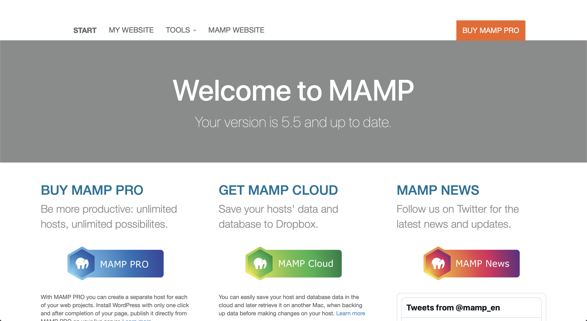
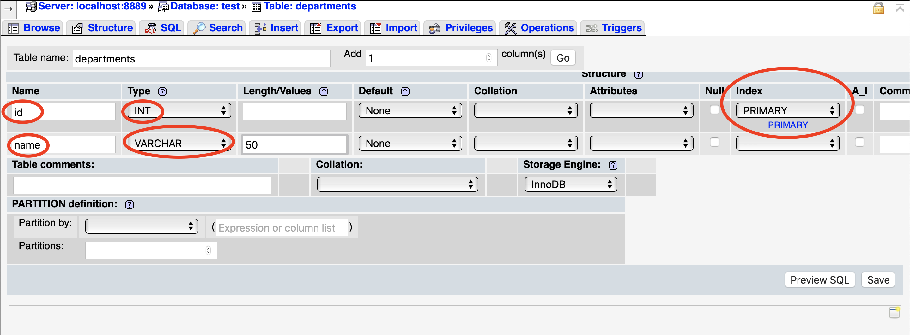

# Install MySQL on Mac OS

## Spec
Version OS : Catalina 10.15.7 or higher
Version MAMP : 5.5 

## What is MAMP?

MAMP is a free, open-source software that allows you to easily install and run Apache, PHP, and MySQL on your local machine. MAMP is a popular solution for web developers who want to develop and test websites locally before uploading them to a live server. In this section, we'll focus on how to use MAMP to set up and use MySQL on MacOS. 

## Step 1: Download and Install MAMP

The first step is to download and install MAMP on your MacOS machine. You can download the latest version of MAMP from the official website : https://www.mamp.info/en/downloads/

Once the download is complete, double-click on the downloaded file to begin the installation process. Follow the on-screen instructions to install MAMP on your machine.

## Step 2: Start MAMP Server

After installing MAMP, you can start the server by double-clicking on the MAMP icon in the Applications folder. This will launch the MAMP control panel.

Click on the Start Servers button to start the Apache and MySQL servers. You can check the status of the servers by looking at the indicators in the MAMP control panel. The Apache server is running if the status indicator is green, and the MySQL server is running if the status indicator is also green.


## Step 3: Create a test Database with graphic interface in MAMP

Once the servers are running, you can create a database. To do this, click on the Open WebStart page button in the MAMP control panel. This will launch the MAMP homepage in your default browser.



Click on the phpMyAdmin link on the left-hand side of the MAMP homepage to launch the phpMyAdmin interface. phpMyAdmin is a web-based interface that allows you to manage your MySQL databases.


In the phpMyAdmin interface, click on the Databases tab


and then enter a name for your new database in the Create Database field for our case `test`.


Click on the Create button to create the database and add a table name `departments` who look like this in SQL command line : 

```
CREATE TABLE departments (
  id INT PRIMARY KEY,
  name VARCHAR(50)
);
```


after validating the table creation we have to specify two field like above :



and then you can see your new database :


## Why MySQL Workbench

MySQL Workbench and MAMP are two different software tools that can be used to work with MySQL databases, but they have different features and use cases.

MySQL Workbench is a graphical user interface (or GUI) tool that is designed for database administrators and developers who need to manage and develop MySQL databases. It provides a wide range of features for working with databases, including:

* Creating and managing database schemas
* Designing and executing SQL queries
* Visualizing database structures with ER diagrams
* Managing user accounts and permissions
* Managing database backups and restores

MySQL Workbench is a powerful tool for working with MySQL databases, but it can be complex and may have a steep learning curve for beginners and we thinks it's more easy to handle and query database.

MAMP, on the other hand, is a lightweight web development environment that is designed to make it easy to set up a local web server on your computer. It includes a range of tools that are useful for web developers, including:

* Apache web server
* MySQL database server
* PHP scripting language

MAMP is designed to be easy to use and configure, and is a good choice for beginners who want to set up a local web development environment quickly and easily.

### Difference between MySQL and MAMP

In summary, MySQL Workbench is a powerful tool for working with MySQL databases, while MAMP is a lightweight web development environment that includes a MySQL database server as one of its components. Which one you choose to use depends on your specific needs and level of expertise.

## Install MySQL Workbench

Go to the official download link : https://dev.mysql.com/downloads/workbench/ 

Download the appropriate version of the software for your OS and **lunch MAMP SQL server** then open the software and click on the button `MySQL Connection` > `Local Instance` like the screen below : 


If you don't have change anything you have the following ids : 

* user : root 
* password : root 

Good you are now connected to MAMP SQL Server 🥳


## Wrap up 

In this tutorial, we have seen how to install MAMP on MacOS and use it to create and manage MySQL databases. Here some important notions about what you have learned through the MAMP installation and MySQL server and client:

* MAMP is a software package that allows you to easily install a local web server on your computer, which includes Apache, MySQL, and PHP.
* With MAMP, you can easily set up a MySQL server and manage databases and data with the MySQL client.
* To install MAMP on Windows, you can download the MAMP software package and follow the installation instructions. Once installed, you can access the MySQL server and client through the MAMP control panel.
* MySQL client is a command-line tool that allows you to interact with the MySQL server, execute SQL queries, and manage databases.
* MySQL server is the software that stores and manages databases, and allows multiple clients to connect to it and perform operations on the databases.
* SQL (Structured Query Language) is the language used to interact with relational databases like MySQL, and it provides a standardized syntax for creating, modifying, and querying databases.
* With the MySQL client, you can create and manage databases, create tables, and insert, update, and delete data with SQL queries.
* By practicing with MAMP and the MySQL Workbench, you have learned the basics of how to install and set up a MySQL server and interact with it.

**In short, SQL is the language used to communicate with databases, while the MySQL server is the software that manages the databases and listens for connections from clients like the MySQL client. The MySQL client is the tool used to connect to the MySQL server and execute SQL queries.** 


